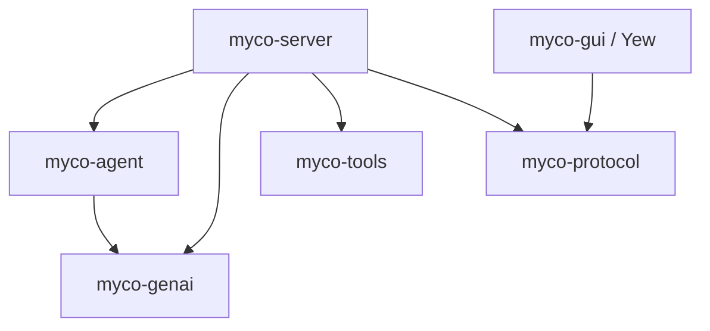
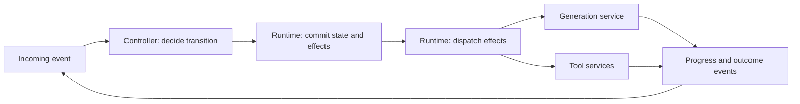

# Architecture and interfaces

The boundaries below separate agent decisions from execution and persistence.
The signatures specify the proposed contracts; crates are implemented in the
review sequence at the end of this document.

## Crates and dependencies

| Crate | Responsibility |
| --- | --- |
| `myco-genai` | One generative inference attempt through a concrete `Client`, configured by a backend `Config` enum. OpenAI Responses and Anthropic Messages drivers are private implementation details. |
| `myco-agent` | The default conversation controller: context assembly, compaction, triggers, response interpretation, and typed transitions for **one agent**. Returns state changes and effects; defines semantic state access without a persistence format. |
| `myco-tools` | Shared tool instances, worker lifetimes, operation records, observation streams, and human/agent control through `Harness`. |
| `myco-protocol` | Versioned HTTP request/response and streamed-event schemas shared by server and clients. Wire types are separate from agent and tool implementation types. |
| `myco-server` | Application crate hosting controllers and composing generation, tools, storage, and protocol. Its runtime owns workspaces, persistence formats, event delivery, effect dispatch, task supervision, HTTP endpoints, and process lifecycle. |
| `myco-gui` | Yew frontend using `myco-protocol` to interact with agents and shared tools. |



Arrows denote Rust dependencies. `myco-protocol` is usable in the browser and
does not import the server or the agent engine. The server maps between wire
types and domain types. Lower crates have no dependency on application storage,
HTTP routing, or UI code. `myco-agent` uses generative request/response types but
does not call model or tool services during a transition.

The direct `myco-server` dependency on `myco-genai` is intentional: the server's
effect interpreter invokes the generation client after commit. The agent crate
decides what to generate and how to interpret the outcome. Service execution
does not live inside `Agent::step`.

`Client::generate` is an async operation returning one `Result<Response, Error>`.
An async, fallible observation callback receives request evidence and provider
progress in order; recording the request completes before dispatch. Dropping the
generation future releases its HTTP request. Backend polymorphism stays behind
an internal `Driver` trait. The public client has no backend type parameters or
implementable model trait. Scripted evaluation behavior belongs in the effect
interpreter; provider tests exercise the concrete client through HTTP fixtures.

## Controllers, effects, and services

| Concept | Responsibility | Example |
| --- | --- | --- |
| Controller | Decide how an event changes conversation state and what work to request next. | The ordinary agent loop or a search policy. |
| Effect | Describe a requested operation with stable correlation data. | Generate a reply from specified context. |
| Service | Execute a capability and report observations and outcomes. | Inference, bash, or storage. |
| Tool | Expose a capability through the model's tool catalog. | Execute a command or consult another model. |

`Generate` is an effect whether or not inference is exposed as a tool. A service
can serve model tool calls, controller requests, and human interfaces. Services
retain their own request types, lifetimes, retry constraints, and cancellation
semantics. The shared runtime handles operation correlation and supervision;
there is no universal service protocol or combined services crate in this design.

The default agent controls prompts, context, compaction, tool requests, outcome
interpretation, and turn completion. Its runtime supervises the resulting work.
A running agent actor comprises a mailbox, its exclusively owned controller,
and the runtime's operation tracking. The controller records which outcomes it
awaits; service clients and live execution handles belong to the runtime and
services. This keeps the state machine independent of sockets and subprocesses.



The event pump remains available while services run. Each controller handles
one event at a time; independent operations and controllers may run concurrently.
Only controller transitions can propose changes to the accepted transcript.

## Conversation identity and thread ownership

The signatures below use `Agent<S>` for the default controller and currently
attach its durable identity, threads, and execution traces to that owner. A
separate durable conversation container is an open modeling choice:

| Proposed concept | Responsibility |
| --- | --- |
| `Session` | Own the durable conversation identity, thread relationships, controller checkpoints, and operation traces. Its lifetime is independent of clients and running tasks. |
| `Thread` | Identify an ordered transcript with a revision and an optional parent prefix for branching. |
| `Agent` controller | Implement the ordinary conversation policy: choose effects and decide which outcomes extend the conversation. |
| Generation operation | Produce a candidate continuation from a specified context and retain its evidence. |

This would separate stored conversations from the policy driving them. Renaming
the controller itself to `Session` would still leave it responsible for prompts,
tool sequencing, compaction, and outcome interpretation. The ownership question
to resolve before implementing the controller is whether `Session` becomes the
durable container, with `Agent<S>` naming only its default controller. The
signature sketches do not yet introduce session types or IDs.

Generation does not mutate a thread directly. A committed generation operation
records its originating turn, target thread, input transcript revision, and
purpose. Progress is retained as evidence; it does not advance that transcript
revision. On completion, the controller checks the operation's correlation and
target revision before proposing an append. The store commits that append with
the controller transition and any follow-up effects. Repeated terminal outcomes
are reconciled by operation ID so they cannot append the same response twice.
An obsolete or unselected response remains evidence without extending the thread.
Each writable thread has one controller owner. A session container could group
several branches without serializing their service execution; it would not give
several controllers authority to append to the same thread.

Tool instances belong to workspaces and can be shared by controllers and humans.
Workspace membership alone is not filesystem isolation. Adding a session
container would not make it the owner of live terminals, workers, or connections.

## One owner, one transition

`Agent<S>` owns the state of one agent in phase `S`. It is neither `Clone` nor
`Copy`; its fields and phase constructors are private. A step takes `self` by
value, so even constructing its future moves the agent. No second step can use
that instance until ownership returns from the first step.

The core API has a typed event input and an associated successor type:

```rust
pub trait Step<E>: Sized + Send + private::Sealed {
    type Next: Send;

    fn step(
        self,
        event: Event<E>,
        state: &dyn StateReader,
    ) -> impl Future<Output = Result<Transition<Self::Next>, Rejected<Self, E>>> + Send;
}

pub struct Rejected<A, E> {
    pub agent: A,
    pub event: Event<E>,
    pub error: StepError,
}
```

`Event<E>` pairs a stable event ID with payload `E`. State reads use the agent's
committed revision and return immutable views. A step may await these reads; it
never waits for model completion, tool completion, another event, or a clock.
All externally visible writes are returned as data. Time and random choices
needed for a decision are explicit inputs so a recorded transition can be replayed.

Rejection returns the unchanged agent and event with no state changes or effects.
An invalid event or failed state read must not lose ownership. Provider and tool
failures are normal outcome events that the state machine records and handles;
they are not automatically transition errors.

Ownership guarantees apply to an instance, not globally to an agent ID. The
server maintains one owner per loaded agent, and storage checks the expected
revision on commit. A stale owner cannot commit or launch effects. Restore
validates the phase and its correlations before constructing a typed agent.

## Typed phases and runtime events

The initial phases distinguish what the agent is waiting to observe:

- `Ready`: accepts a new turn from a user or trigger.
- `AwaitingModel`: expects an outcome for an issued generation operation.
- `AwaitingTools`: expects results for the tool calls in an assistant response.
- `Cancelling`: expects terminal outcomes for operations whose cancellation was
  requested; it cannot schedule a continuation of that turn.

These types carry required correlation data, not just marker names.
`AwaitingTools` retains references to requested observations, derived from the
agent trace. It does not assert that a tool is running or own any live tool
resource. The tool service owns execution status.

| Phase | Event | Successor | Executable effects |
| --- | --- | --- | --- |
| `Ready` | `Start` | `AwaitingModel` | Generate a reply or compact context first. |
| `AwaitingModel` | `GenerationFinished` | `Ready`, `AwaitingTools`, or `AwaitingModel` | None for a final answer/failure; invoke requested tools; or generate a reply after compaction. |
| `AwaitingTools` | `ToolFinished` | `AwaitingTools` or `AwaitingModel` | Generate only when all required results have been recorded. |
| `AwaitingModel` / `AwaitingTools` | `Cancel` | `Cancelling` | Request cancellation of outstanding operations. |
| `Cancelling` | Terminal operation outcome | `Cancelling` or `Ready` | No continuation; return to `Ready` once all outstanding outcomes are known. |
| `Ready` / `Cancelling` | `Cancel` for the same turn | Same phase | None; cancellation is idempotent. |
| Any phase expecting an operation | Correlated progress | Same phase | None; retain provisional evidence. |

For example, `Step<Start> for Agent<Ready>` has
`type Next = Agent<AwaitingModel>`. There is no
`Step<GenerationFinished> for Agent<Ready>`. A transition with several possible
successors returns an enum whose variants each contain the corresponding typed
agent. The caller must match that enum before using state-specific operations:

```rust
pub enum AfterGeneration {
    Ready(Agent<Ready>),
    Tools(Agent<AwaitingTools>),
    Model(Agent<AwaitingModel>),
}
```

Each generation carries its purpose (reply or compaction). Compaction changes
the active thread only after its successful outcome is committed. Other phases
or policies can refine the graph without exposing arbitrary state mutation.

The event's phase is a static check for typed callers. Turn IDs, operation IDs,
the remaining number of tool results, and whether a generation requested tools
are runtime facts. Those require validation even in the typed API. A provider's
tool-call ID is retained for inference history but is not used as a globally
unique execution ID.

The server receives an `AgentEvent` enum from runtime sources. A `RuntimeAgent`
enum holds the possible typed agents and routes each event through the same
`Step<E>` implementations. An optional object-safe facade hides that enum from
callers storing heterogeneous implementations:

```rust
pub type BoxFuture<'a, T> = Pin<Box<dyn Future<Output = T> + Send + 'a>>;
pub type DynStepResult = Result<
    Transition<Box<dyn DynAgent>>,
    Rejected<Box<dyn DynAgent>, AgentEvent>,
>;

pub trait DynAgent: Send {
    fn step<'a>(
        self: Box<Self>,
        event: Event<AgentEvent>,
        state: &'a dyn StateReader,
    ) -> BoxFuture<'a, DynStepResult>
    where
        Self: 'a;
}
```

The dynamic boundary checks event legality at runtime and returns the original
boxed agent on rejection. It does not duplicate transition logic. `Box<Self>`
and an explicitly boxed future make the facade
[dyn-compatible](https://doc.rust-lang.org/reference/items/traits.html#dyn-compatibility).
The typed layer uses ordinary trait implementations for concrete states, not
unstable Rust specialization.

## Returned effects and the commit boundary

Effects are inspectable intent, not callbacks. Each has a stable operation ID
that survives delivery retries. The initial vocabulary is generation, tool
invocation, and cancellation:

```rust
pub struct Effect {
    pub id: OperationId,
    pub action: Action,
}

pub enum Action {
    Generate { purpose: GenerationPurpose, request: myco_genai::Request },
    InvokeTool { call: myco_genai::ToolCall },
    Cancel { target: OperationId },
}
```

Generation and tool invocation use the same commit/dispatch/outcome cycle while
retaining distinct typed payloads. Service completion does not execute returned
tool calls or append an assistant response. Those decisions require another
controller transition and commit.

`Transition<Next>` contains the proposed successor, semantic state changes, and
effects. Its fields are private. Inspection borrows the proposal; it cannot
extract an agent capable of another step or an executable effect batch before
commit. This is a second use of typestate: proposed versus committed work.

State access is injected through domain interfaces in `myco-agent`:

```rust
pub trait StateReader: Send + Sync {
    fn read(&self, at: StateVersion) -> BoxFuture<'_, Result<StateView, StateError>>;
}

pub trait StateStore: StateReader {
    fn commit<'a>(
        &'a self,
        proposal: &'a Commit,
    ) -> BoxFuture<'a, Result<(), StateError>>;
}
```

`StateVersion` identifies an agent and revision. `StateView` contains semantic
thread/trace data at that revision. `Commit` describes the agent, consumed event,
expected revision, successor state, trace changes, and effect requests. None of
these types prescribes JSON, database tables, or a serialization format. The
server supplies the storage implementation and chooses versioned encodings.

Saving state is a required commit phase, rather than an optional `SaveState`
item mixed into an unordered effect list. `StateStore::commit` atomically saves
the successor state, consumed event, trace changes, and a durable queue of effect
requests (an outbox). It checks the expected revision and is idempotent for the
same event and identical proposal; a conflicting proposal is rejected. Only
after confirmed commit can effects be dispatched.

Storage is a service in the architectural vocabulary, but committing state is
a prerequisite for executing the proposed effects. It is not an independently
scheduled sibling of `Generate` or `InvokeTool`.

The consuming commit operation has this contract:

```rust
impl<Next> Transition<Next> {
    pub fn proposal(&self) -> &Commit;

    pub async fn commit(
        self,
        state: &dyn StateStore,
    ) -> Result<(Next, CommittedEffects), CommitFailure<Next>>;
}

pub struct CommitFailure<Next> {
    pub transition: Transition<Next>,
    pub error: StateError,
}
```

This is a signature sketch; the `impl` body is supplied with the agent crate.
`CommittedEffects` identifies the committed batch for the interpreter. Its
constructor is private. A commit error retains the proposal for retry or
reconciliation, without exposing a runnable successor. An ambiguous timeout
requires checking whether the same event committed; a revision conflict
requires reload. Neither permits blind dispatch or continued stepping.

The caller sequences owned values:

```rust
let transition = agent.step(event1, &state).await?;
let (agent, effects) = transition.commit(&state).await?;
executor.wake(effects);

let transition = agent.step(event2, &state).await?;
let (agent, effects) = transition.commit(&state).await?;
executor.wake(effects);
```

This example uses the dynamic facade; a typed caller matches branching successor
enums between steps. The effect interpreter runs committed requests separately
from the event pump in `myco-server`. A wakeup only prompts it to drain the durable
queue, so a crash between commit and notification does not lose work. It invokes
a configured `myco_genai::Client` and injected `myco_tools::Harness` implementations
and delivers correlated progress/outcomes as later events. Evaluations can substitute the
interpreter's generation behavior with scripted responses. Different effects and
different agents can execute concurrently. In-memory evaluation stores implement
the same commit contract without requiring disk storage.

These guarantees assume the injected store and interpreter obey their contracts;
Rust types do not prove that an external database or tool has done so.

## Cancellation and recovery

`Cancel` names a turn, so a delayed cancellation cannot stop a newer turn.
It is processed through the same exclusive event path and commits cancellation
intent before effects are requested. The interpreter suppresses undispatched
operations and requests cancellation of dispatched operations. A cancellation
acknowledgement is distinct from a terminal outcome; successful cancellation
does not undo a tool's earlier side effects. Unknown outcomes remain unresolved.
Dropping a generation future settles the local inference attempt as cancelled;
it is not an acknowledgement that the provider stopped computing or billing.

Ordering decides a completion/cancellation race. If completion commits first,
its result remains recorded. If cancellation commits first, later outcomes are
retained as evidence but cannot schedule another generation or tool invocation
for that turn. The turn returns to `Ready` only when the outstanding operations
have terminal outcomes. Already queued follow-up effects are subject to the
committed cancellation intent before dispatch. Claiming an effect and checking
that intent must be atomic in the server's store. An already claimed request is
in flight and can race with cancellation. The tool service remembers cancellation
by target operation ID even if it arrives before submission, so delayed delivery
cannot start an operation that it has already cancelled.

Busy agents reject new `Start` events; the server may queue those inputs outside
the machine without blocking progress, result, or cancellation events. Duplicate
events are acknowledged without applying their transition twice. Late or
mismatched outcomes cannot advance the current turn; their evidence stays linked
to the original operation. Model streaming fragments are provisional evidence;
only a validated completion becomes an assistant response in the transcript.

A cancellation event cannot interrupt a currently awaited step or commit. Those
operations must be bounded and do no long-running external work. The supervisor
awaits the boundary and then pumps cancellation. Dropping a consuming future
also drops its in-memory agent; that is an abort/recovery path, not ordinary
user cancellation. Before commit, reload the last durable revision. During an
ambiguous commit, reconcile its event ID before resuming or dispatching work.

Both agent traces and tool-service records are retained and linked by operation
ID. For example:

1. The agent commits a tool request and its effect.
2. The tool service accepts it, performs the work, and records the result.
3. The server crashes before committing that result to the agent trace.

On restart, the agent trace contains a request without a result even though the
tool finished. The server queries the tool record using the same operation ID
and delivers the recorded result. If it is still running, the server resumes
observation. If the tool service cannot establish what happened, the operation
remains unresolved; the server does not rerun it under a new ID or invent a
successful cancellation. Durable submission deduplication is a tool-service
contract, not a claim of exactly-once external side effects. Model requests
likewise cannot assume provider-side deduplication after an ambiguous disconnect.

## Application lifecycle, protocols, and evaluation

`myco-server` owns per-agent mailboxes and owners, effect dispatch, tool workers,
storage, and HTTP listeners. Startup restores and validates agents, reconciles
committed effects and tool records, then resumes pumping. Shutdown stops intake,
finishes or reconciles in-progress commits, records cancellation policy for
outstanding work, and supervises workers. Client connections do not own agent
or tool lifetimes. Trigger semantics live in the agent; clocks, watchers, and
HTTP requests deliver trigger events from outside it.

The server supervises service-operation futures and routes their observations
back through the event pump. The common agent interface can remain convenient
without embedding generation inside a consuming state transition. Runtime
supervision and conversation decisions remain separate responsibilities even
when one application hosts both.

`myco-protocol` covers workspace, agent, thread, and tool operations and their
observation streams. Mutating requests carry request IDs for deduplication;
acceptance is distinct from completion. Stream cursors support reconnecting
clients. Wire versions and storage versions are independent. `myco-gui` is a Yew
client of this HTTP API, using the same operations available to machine callers.
There is no interactive CLI in this application.

Evaluators call the same transition interfaces with candidate configuration,
state fixtures, model/tool interpreters, budgets, and graders. Returned effect
data can be inspected, replayed, or replaced without instrumentation hooks inside
the agent. Trials retain exact inference inputs, outcomes, candidate identity,
and tool evidence. GEPA consumes scores, traces, and diagnostic feedback through
an adapter over those evaluations.

## Forking and search

Generation effects make inference available independently of the ordinary agent
loop. A search controller can request several candidates from the same immutable
context, score their outcomes, and select which continuation to accept or fork.
Each candidate has its own operation ID; candidates are not appended sequentially
to a shared input transcript. The default agent can retain its single-generation
policy without acquiring search-specific phases.

A fork records its source thread and revision and creates a distinct writable
thread. An independently running branch gets its own controller identity and
fresh operation IDs. It does not clone a live `Agent`, running futures, or pending
operations. Forking from a settled checkpoint is the initial contract; forks
during unresolved work require an explicit policy for the outstanding outcomes.
Shared transcript prefixes can stay immutable. Branches that execute tools need
isolated workspaces or must defer those effects until selection; forking
conversation state alone does not isolate external side effects.

Search and fork APIs follow the ordinary controller implementation. The reusable
boundary is effect execution; no generic workflow-controller trait is required
before a second controller establishes the shared interface.

## State-machine library choice

[`cookie-factory`](https://github.com/rust-bakery/cookie-factory) composes binary
serializers; it does not supply an agent state-machine abstraction.
[`state-machines`](https://github.com/state-machines/state-machines-rs) offers
consuming typestate transitions and a dynamic dispatch mode, making it a candidate
for implementing the graph. Its callbacks would not be used to execute effects.
The choice between its generated machinery and handwritten enums/traits should
be checked against ownership recovery, branching successors, and commit gating.
The contracts above stay independent of that choice. No state-machine dependency
is selected in this design layer.

## Review sequence

1. **Architecture and interfaces.** Review the crate graph, typed/dynamic
   transition boundary, state/effect commit contract, service execution,
   cancellation, and recovery. Resolve durable conversation ownership before
   introducing controller/session types in code.
2. **Generative AI boundary.** Implement `myco-genai`: a concrete async client,
   private backend drivers, awaited observations, native continuation,
   explicit incomplete/error outcomes, and future-drop cancellation. Validate
   with local HTTP fixtures without API credentials.
3. **Default conversation controller.** Implement the reviewed interfaces with
   an in-memory store and scripted effect interpreter, then threads and bounded
   compaction.
   Check rejection preserves ownership; illegal typed transitions fail to compile;
   the dynamic facade matches typed behavior; no dispatch precedes commit; and
   cancellation, duplicate outcomes, and recovery preserve transcript integrity.
4. **Shared tools.** Implement `myco-tools` with one workspace terminal,
   independent observers, human/agent control, operation records, cancellation,
   and worker supervision. Test deduplication and ambiguous execution outcomes.
5. **Protocol and server.** Define `myco-protocol` wire contracts and implement
   `myco-server`, durable state, effect delivery, reconciliation, and shutdown.
6. **Yew GUI.** Implement `myco-gui` for agent/thread browsing and shared tools.
7. **Evaluation and GEPA.** Run isolated task fixtures through the same agent
   interfaces and emit inspectable results and optimizer feedback.

Each step is a review boundary. Interfaces are reviewed before their production
implementations; later crates are added as their steps are reached.
