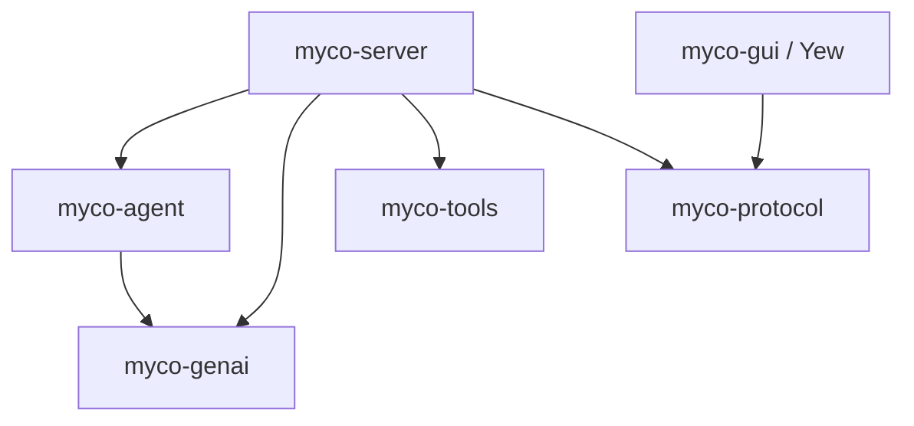
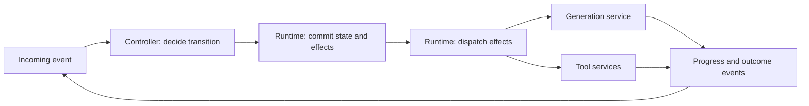
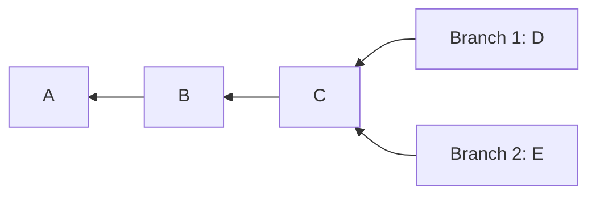

# Architecture and interfaces

The boundaries below separate agent decisions from execution and persistence.
The signatures specify the proposed contracts; crates are implemented in the
review sequence at the end of this document.

## Crates and dependencies

| Crate | Responsibility |
| --- | --- |
| `myco-genai` | One generative inference attempt through a concrete `Client`, configured by a backend `Config` enum. OpenAI Responses and Anthropic Messages drivers are private implementation details. |
| `myco-agent` | Session and thread logic, immutable checkpoints, typed state transitions, context assembly, and autocompaction. Stateless transition functions return proposed checkpoints and effects; the crate defines persistence contracts without prescribing storage formats. |
| `myco-tools` | Shared tool instances, worker lifetimes, operation records, observation streams, and human/agent control through `Harness`. |
| `myco-protocol` | Versioned HTTP request/response and streamed-event schemas shared by server and clients. Wire types are separate from agent and tool implementation types. |
| `myco-server` | Application crate composing state transitions, generation, tools, storage, and protocol. Its runtime owns branch writers, workspaces, persistence formats, event delivery, effect dispatch, task supervision, HTTP endpoints, and process lifecycle. |
| `myco-gui` | Yew frontend using `myco-protocol` to interact with agents and shared tools. |



Arrows denote Rust dependencies. `myco-protocol` is usable in the browser and
does not import the server or the agent engine. The server maps between wire
types and domain types. Lower crates have no dependency on application storage,
HTTP routing, or UI code. `myco-agent` uses generative request/response types but
does not call model or tool services during a transition.

The direct `myco-server` dependency on `myco-genai` is intentional: the server's
effect interpreter invokes the generation client after commit. The agent crate
decides what to generate and how to interpret the outcome. Service execution
does not live inside `agent::step`.

`Client::generate` is an async operation returning one `Result<Response, Error>`.
An async, fallible observation callback receives request evidence and provider
progress in order; recording the request completes before dispatch. Dropping the
generation future releases its HTTP request. Backend polymorphism stays behind
an internal `Driver` trait. The public client has no backend type parameters or
implementable model trait. Scripted evaluation behavior belongs in the effect
interpreter; provider tests exercise the concrete client through HTTP fixtures.

## Controllers, effects, and services

| Concept | Responsibility | Example |
| --- | --- | --- |
| Controller | Decide how an event changes conversation state and what work to request next. | The ordinary agent loop or a search policy. |
| Effect | Describe a requested operation with stable correlation data. | Generate a reply from specified context. |
| Service | Execute a capability and report observations and outcomes. | Inference, bash, or storage. |
| Tool | Expose a capability through the model's tool catalog. | Execute a command or consult another model. |

`Generate` is an effect whether or not inference is exposed as a tool. A service
can serve model tool calls, controller requests, and human interfaces. Services
retain their own request types, lifetimes, retry constraints, and cancellation
semantics. The shared runtime handles operation correlation and supervision;
there is no universal service protocol or combined services crate in this design.

The `agent` module supplies the default conversation policy through stateless
transition functions. All state affecting prompts, context, compaction, tool
requests, outcome interpretation, and turn completion is explicit in checkpoints.
A running branch comprises a mailbox, an exclusively owned `State<P>`, and the
runtime's operation tracking. Checkpoints record which outcomes are awaited;
service clients and live execution handles belong to the runtime and services.



The event pump remains available while services run. Each branch handles one
event at a time; independent operations and branches may run concurrently.
Only state transitions can propose changes to the accepted transcript.

## Sessions, threads, and immutable checkpoints

| Concept | Responsibility |
| --- | --- |
| `Session` | Describe conversation identity, configuration, and session metadata at a fixed version. Group related threads and operation traces independently of client and task lifetimes. |
| `Thread` | Describe an ordered transcript at a fixed revision, with lineage identifying its source history. |
| `Checkpoint<P>` | Capture consistent session and thread snapshots, execution phase `P`, and all other state needed to resume decisions. Cloneable data with no execution authority. |
| `State<P>` | Own a checkpoint and the exclusive right to advance its running branch. Consumed by transitions; not cloneable. |
| `agent` module | Apply the conversation policy to explicit state and events, returning proposed checkpoints and effects. |
| Generation operation | Produce a candidate continuation from a specified context and retain its evidence. |

A checkpoint is logically immutable. Its session version, thread revision,
configuration, phase, and correlations retain the same observable values for
its lifetime. A transition proposes a new checkpoint; commit publishes it as
the branch's current checkpoint. Previously retained snapshots remain unchanged.
Session and thread constructors are private so callers cannot pair incompatible
snapshots or bypass their invariants. Each checkpoint selects its current thread;
branches do not share a mutable current-thread pointer.

`Checkpoint<P>::clone` copies the same snapshot, including its identity and
version. It neither starts work nor creates another writer. Activating a fork
assigns new writable branch and thread identities through an explicit commit.
This separates cheap speculative copies from permission to change durable state.

The public contract does not prescribe `Arc<Checkpoint>`, `Arc<Session>`, or a
particular history collection. A checkpoint can be a small owned value sharing
immutable roots internally. `Arc` provides shared ownership; private APIs must
still enforce immutability. Shared mutable session/thread payloads would violate
the snapshot contract. The execution phase is explicit even though the transition
logic itself is stateless.

Thread history can share immutable prefixes. Appending constructs a new tail
whose parent points backward to the existing history; it never fills in a
forward link on a previously published node. Forks share their source prefix:



Immutable chunks or persistent collections can implement this sharing without
requiring one allocation per message. A checkpoint need not retain the entire
preceding checkpoint. Durable references use stable IDs and versions; `Arc`
shares resident data only. Compaction can retain source lineage by ID while
allowing old history to leave memory. Restoring an older checkpoint loads the
same historical values rather than substituting the latest session metadata.

## Generation and transcript acceptance

Generation does not mutate a thread directly. A committed generation operation
records its originating turn, target thread, input transcript revision, and
purpose. Progress is retained as evidence; it does not advance that transcript
revision. On completion, the controller checks the operation's correlation and
target revision before proposing an append. The store commits that append with
the controller transition and any follow-up effects. Repeated terminal outcomes
are reconciled by operation ID so they cannot append the same response twice.
An obsolete or unselected response remains evidence without extending the thread.
Each writable thread has one branch owner. A session can group several branches
without serializing their service execution; session membership does not give
several owners authority to append to the same thread.

Tool instances belong to workspaces and can be shared by controllers and humans.
Workspace membership alone is not filesystem isolation. A session does not own
live terminals, workers, or connections.

## One owner, one transition

`State<P>` owns one branch in phase `P`. It is neither `Clone` nor `Copy`; its
fields and constructors are private. A step takes this owner by value, so even
constructing its future moves the state. No second step can use that owner until
ownership returns. Sharing or cloning its checkpoint grants no stepping rights.

The representation below names private implementation types without fixing their
storage layout. `Checkpoint<P>` implements `Clone`; `BranchOwner` does not.

```rust
pub struct Checkpoint<P> {
    snapshot: Snapshot<P>,
}

impl<P> Checkpoint<P> {
    pub fn session(&self) -> &Session;
    pub fn thread(&self) -> &Thread;
    pub fn phase(&self) -> &P;
}

pub struct State<P> {
    checkpoint: Checkpoint<P>,
    owner: BranchOwner,
}

impl<P> State<P> {
    pub fn checkpoint(&self) -> &Checkpoint<P>;
}
```

The core API has a typed event input and an associated successor type:

```rust
pub trait Step<E>: Sized + Send + private::Sealed {
    type Next: Send;

    fn step(
        self,
        event: Event<E>,
        reader: &dyn StateReader,
    ) -> impl Future<Output = Result<Transition<Self::Next>, Rejected<Self, E>>> + Send;
}

pub struct Rejected<S, E> {
    pub state: S,
    pub event: Event<E>,
    pub error: StepError,
}
```

The stateless module entry point delegates to the same sealed implementations:

```rust
pub async fn step<S, E>(
    state: S,
    event: Event<E>,
    reader: &dyn StateReader,
) -> Result<Transition<S::Next>, Rejected<S, E>>
where
    S: Step<E>,
    E: Send,
{
    state.step(event, reader).await
}
```

`Event<E>` pairs a stable event ID with payload `E`. State reads resolve the
checkpoint's fixed versions and return immutable views. A step may await those
reads; it never waits for model completion, tool completion, another event, or
a clock. All externally visible writes are returned as data. Time and random
choices needed for a decision are explicit inputs so a recorded transition can
be replayed.

Rejection returns the unchanged state owner and event with no state changes or
effects. An invalid event or failed state read must not lose ownership. Provider
and tool failures are normal outcome events that the state machine records and
handles; they are not automatically transition errors.

Ownership guarantees apply to an instance, not globally to a branch ID. The
server maintains one owner per loaded branch, and storage checks the expected
revision on commit. A stale owner cannot commit or launch effects. Restore
validates the checkpoint's snapshots, phase, and correlations before constructing
a typed owner under the runtime's writer gate. Loading a checkpoint for inspection
or evaluation does not acquire that authority.

## Typed phases and runtime events

The initial phases distinguish what the branch is waiting to observe:

- `Ready`: accepts a new turn from a user or trigger.
- `AwaitingModel`: expects an outcome for an issued generation operation.
- `AwaitingTools`: expects results for the tool calls in an assistant response.
- `Cancelling`: expects terminal outcomes for operations whose cancellation was
  requested; it cannot schedule a continuation of that turn.

These types carry required correlation data, not just marker names.
`AwaitingTools` retains references to requested observations, derived from the
operation trace. It does not assert that a tool is running or own any live tool
resource. The tool service owns execution status.

| Phase | Event | Successor | Executable effects |
| --- | --- | --- | --- |
| `Ready` | `Start` | `AwaitingModel` | Generate a reply or compact context first. |
| `AwaitingModel` | `GenerationFinished` | `Ready`, `AwaitingTools`, or `AwaitingModel` | None for a final answer/failure; invoke requested tools; or generate a reply after compaction. |
| `AwaitingTools` | `ToolFinished` | `AwaitingTools` or `AwaitingModel` | Generate only when all required results have been recorded. |
| `AwaitingModel` / `AwaitingTools` | `Cancel` | `Cancelling` | Request cancellation of outstanding operations. |
| `Cancelling` | Terminal operation outcome | `Cancelling` or `Ready` | No continuation; return to `Ready` once all outstanding outcomes are known. |
| `Ready` / `Cancelling` | `Cancel` for the same turn | Same phase | None; cancellation is idempotent. |
| Any phase expecting an operation | Correlated progress | Same phase | None; retain provisional evidence. |

For example, `Step<Start> for State<Ready>` has
`type Next = State<AwaitingModel>`. There is no
`Step<GenerationFinished> for State<Ready>`. A transition with several possible
successors returns an enum whose variants each contain the corresponding typed
owner. The caller must match that enum before using state-specific operations:

```rust
pub enum AfterGeneration {
    Ready(State<Ready>),
    Tools(State<AwaitingTools>),
    Model(State<AwaitingModel>),
}
```

Each generation carries its purpose (reply or compaction). Compaction proposes
a checkpoint selecting a new thread and publishes it only after successful
commit. Older checkpoints retain their original thread and history. Other phases
or policies can refine the graph without exposing arbitrary state mutation.

The event's phase is a static check for typed callers. Turn IDs, operation IDs,
the remaining number of tool results, and whether a generation requested tools
are runtime facts. Those require validation even in the typed API. A provider's
tool-call ID is retained for inference history but is not used as a globally
unique execution ID.

The server receives an `AgentEvent` enum from runtime sources. A `RuntimeState`
enum holds the possible typed owners and routes each event through the same
`Step<E>` implementations. An optional object-safe facade hides that enum from
callers storing heterogeneous implementations:

```rust
pub type BoxFuture<'a, T> = Pin<Box<dyn Future<Output = T> + Send + 'a>>;
pub type DynStepResult = Result<
    Transition<Box<dyn DynState>>,
    Rejected<Box<dyn DynState>, AgentEvent>,
>;

pub trait DynState: Send {
    fn step<'a>(
        self: Box<Self>,
        event: Event<AgentEvent>,
        reader: &'a dyn StateReader,
    ) -> BoxFuture<'a, DynStepResult>
    where
        Self: 'a;
}
```

The dynamic boundary checks event legality at runtime and returns the original
boxed owner on rejection. It does not duplicate transition logic. `Box<Self>`
and an explicitly boxed future make the facade
[dyn-compatible](https://doc.rust-lang.org/reference/items/traits.html#dyn-compatibility).
The typed layer uses ordinary trait implementations for concrete states, not
unstable Rust specialization.

## Returned effects and the commit boundary

Effects are inspectable intent, not callbacks. Each has a stable operation ID
that survives delivery retries. The initial vocabulary is generation, tool
invocation, and cancellation:

```rust
pub struct Effect {
    pub id: OperationId,
    pub action: Action,
}

pub enum Action {
    Generate { purpose: GenerationPurpose, request: myco_genai::Request },
    InvokeTool { call: myco_genai::ToolCall },
    Cancel { target: OperationId },
}
```

Generation and tool invocation use the same commit/dispatch/outcome cycle while
retaining distinct typed payloads. Service completion does not execute returned
tool calls or append an assistant response. Those decisions require another
controller transition and commit.

`Transition<Next>` contains the proposed successor checkpoint and owner, state
changes, and effects. Its fields are private. Inspection borrows the proposal;
it cannot extract an owner capable of another step or an executable effect
batch before commit. This is a second use of typestate: proposed versus
committed work.

State access is injected through domain interfaces in `myco-agent`:

```rust
pub trait StateReader: Send + Sync {
    fn read(&self, at: StateVersion) -> BoxFuture<'_, Result<StateView, StateError>>;
}

pub trait StateStore: StateReader {
    fn commit<'a>(
        &'a self,
        proposal: &'a Commit,
    ) -> BoxFuture<'a, Result<(), StateError>>;
}
```

`StateVersion` identifies a branch and its committed checkpoint revision.
`StateView` resolves that checkpoint's session, thread, and trace data at fixed
versions. `Commit` describes the branch, consumed event, expected revision,
successor checkpoint, trace changes, and effect requests. `myco-agent` owns these
semantic persistence contracts; the server supplies the storage implementation
and chooses versioned encodings. No pointer address or `Arc` reference count is
part of the durable format.

Saving state is a required commit phase, rather than an optional `SaveState`
item mixed into an unordered effect list. `StateStore::commit` atomically stores
the new immutable snapshots, advances the branch's current-checkpoint reference,
and saves the consumed event, trace changes, and durable effect requests (an
outbox). It checks the expected revision and is idempotent for the same event and
identical proposal; a conflicting proposal is rejected. Publishing a successor
does not rewrite earlier snapshots. Only after confirmed commit can effects be
dispatched.

Storage is a service in the architectural vocabulary, but committing state is
a prerequisite for executing the proposed effects. It is not an independently
scheduled sibling of `Generate` or `InvokeTool`.

The consuming commit operation has this contract:

```rust
impl<Next> Transition<Next> {
    pub fn proposal(&self) -> &Commit;

    pub async fn commit(
        self,
        store: &dyn StateStore,
    ) -> Result<(Next, CommittedEffects), CommitFailure<Next>>;
}

pub struct CommitFailure<Next> {
    pub transition: Transition<Next>,
    pub error: StateError,
}
```

This is a signature sketch; the `impl` body is supplied with the agent crate.
`CommittedEffects` identifies the committed batch for the interpreter. Its
constructor is private. A commit error retains the proposal for retry or
reconciliation, without exposing a runnable successor. An ambiguous timeout
requires checking whether the same event committed; a revision conflict
requires reload. Neither permits blind dispatch or continued stepping.

The caller sequences owned values:

```rust
let transition = agent::step(state, event1, &store).await?;
let (state, effects) = transition.commit(&store).await?;
executor.wake(effects);

let transition = agent::step(state, event2, &store).await?;
let (state, effects) = transition.commit(&store).await?;
executor.wake(effects);
```

This example uses `RuntimeState` implementing `Step<AgentEvent>`; a typed
caller matches branching successor enums between steps. The effect interpreter
runs committed requests separately from the event pump in `myco-server`. A
wakeup only prompts it to drain the durable queue, so a crash between commit
and notification does not lose work. It invokes a configured
`myco_genai::Client` and injected `myco_tools::Harness` implementations and
delivers correlated progress/outcomes as later events. Evaluations can
substitute the interpreter's generation behavior with scripted responses.
Different effects and different branches can execute concurrently. In-memory
evaluation stores implement the same commit contract without requiring disk
storage.

These guarantees assume the injected store and interpreter obey their contracts;
Rust types do not prove that an external database or tool has done so.

## Cancellation and recovery

`Cancel` names a turn, so a delayed cancellation cannot stop a newer turn.
It is processed through the same exclusive event path and commits cancellation
intent before effects are requested. The interpreter suppresses undispatched
operations and requests cancellation of dispatched operations. A cancellation
acknowledgement is distinct from a terminal outcome; successful cancellation
does not undo a tool's earlier side effects. Unknown outcomes remain unresolved.
Dropping a generation future settles the local inference attempt as cancelled;
it is not an acknowledgement that the provider stopped computing or billing.

Ordering decides a completion/cancellation race. If completion commits first,
its result remains recorded. If cancellation commits first, later outcomes are
retained as evidence but cannot schedule another generation or tool invocation
for that turn. The turn returns to `Ready` only when the outstanding operations
have terminal outcomes. Already queued follow-up effects are subject to the
committed cancellation intent before dispatch. Claiming an effect and checking
that intent must be atomic in the server's store. An already claimed request is
in flight and can race with cancellation. The tool service remembers cancellation
by target operation ID even if it arrives before submission, so delayed delivery
cannot start an operation that it has already cancelled.

Busy branches reject new `Start` events; the server may queue those inputs outside
the machine without blocking progress, result, or cancellation events. Duplicate
events are acknowledged without applying their transition twice. Late or
mismatched outcomes cannot advance the current turn; their evidence stays linked
to the original operation. Model streaming fragments are provisional evidence;
only a validated completion becomes an assistant response in the transcript.

A cancellation event cannot interrupt a currently awaited step or commit. Those
operations must be bounded and do no long-running external work. The supervisor
awaits the boundary and then pumps cancellation. Dropping a consuming future
also drops its in-memory owner; retained checkpoint clones remain immutable data,
not replacement writers. This is an abort/recovery path, not ordinary user
cancellation. Before commit, reload the last durable revision and reacquire the
writer through the runtime. During an ambiguous commit, reconcile its event ID
before resuming or dispatching work.

Both session operation traces and tool-service records are retained and linked
by operation ID. For example:

1. The runtime commits a branch's tool request and its effect.
2. The tool service accepts it, performs the work, and records the result.
3. The server crashes before committing that result to the branch checkpoint and trace.

On restart, the operation trace contains a request without a result even though
the tool finished. The server queries the tool record using the same operation ID
and delivers the recorded result. If it is still running, the server resumes
observation. If the tool service cannot establish what happened, the operation
remains unresolved; the server does not rerun it under a new ID or invent a
successful cancellation. Durable submission deduplication is a tool-service
contract, not a claim of exactly-once external side effects. Model requests
likewise cannot assume provider-side deduplication after an ambiguous disconnect.

## Application lifecycle, protocols, and evaluation

`myco-server` owns per-branch mailboxes and writers, effect dispatch, tool
workers, storage, and HTTP listeners. Startup restores and validates committed
checkpoints, acquires their branch owners, reconciles effects and tool
records, then resumes pumping. Shutdown stops intake, finishes or reconciles
in-progress commits, records cancellation policy for outstanding work, and
supervises workers. Client connections do not own branch or tool lifetimes.
Trigger semantics live in the `agent` module; clocks, watchers, and HTTP
requests deliver trigger events from outside it.

The server supervises service-operation futures and routes their observations
back through the event pump. The common agent interface can remain convenient
without embedding generation inside a consuming state transition. Runtime
supervision and conversation decisions remain separate responsibilities even
when one application hosts both.

`myco-protocol` covers workspace, session, thread, branch, and tool operations
and their observation streams. Mutating requests carry request IDs for deduplication;
acceptance is distinct from completion. Stream cursors support reconnecting
clients. Wire versions and storage versions are independent. `myco-gui` is a Yew
client of this HTTP API, using the same operations available to machine callers.
There is no interactive CLI in this application.

Evaluators call the same transition interfaces with candidate configuration,
state fixtures, model/tool interpreters, budgets, and graders. Returned effect
data can be inspected, replayed, or replaced without instrumentation hooks inside
the agent. Trials retain exact inference inputs, outcomes, candidate identity,
and tool evidence. GEPA consumes scores, traces, and diagnostic feedback through
an adapter over those evaluations.

## Forking and search

Generation effects make inference available independently of the ordinary agent
loop. A search controller can request several candidates from the same immutable
context, score their outcomes, and select which continuation to accept or fork.
Each candidate has its own operation ID; candidates are not appended sequentially
to a shared input transcript. The default agent can retain its single-generation
policy without acquiring search-specific phases.

Cloning a checkpoint is valid in any phase for inspection or speculative work.
A runnable fork is created by explicitly committing a new branch and thread
identity with lineage to the source checkpoint. The source session and history
snapshots can be shared; each successor remains independent. The runtime acquires
one new owner after commit, and subsequent effects receive fresh operation IDs.
A snapshot clone does not copy writer authority, running futures, or service
resources, and does not resubmit recorded effects.

Execution forks initially require settled checkpoints. A checkpoint containing
pending requests retains them as evidence; making such a clone runnable requires
an explicit policy for those correlations and outstanding outcomes. Restoring the
original branch reconciles its existing operation IDs rather than allocating a
fork. Branches that execute tools need isolated workspaces or must defer those
effects until selection; immutable conversation data does not isolate external
side effects.

Search orchestration follows the ordinary transition implementation. The reusable
boundary is effect execution; no generic workflow-controller trait is required
before a second controller establishes the shared interface.

## State-machine library choice

[`cookie-factory`](https://github.com/rust-bakery/cookie-factory) composes binary
serializers; it does not supply an agent state-machine abstraction.
[`state-machines`](https://github.com/state-machines/state-machines-rs) offers
consuming typestate transitions and a dynamic dispatch mode, making it a candidate
for implementing the graph. Its callbacks would not be used to execute effects.
The choice between its generated machinery and handwritten enums/traits should
be checked against ownership recovery, branching successors, and commit gating.
The contracts above stay independent of that choice. No state-machine dependency
is selected in this design layer.

## Review sequence

1. **Architecture and interfaces.** Review the crate graph, typed/dynamic
   transition boundary, state/effect commit contract, service execution,
   cancellation, recovery, and immutable checkpoint/branch ownership.
2. **Generative AI boundary.** Implement `myco-genai`: a concrete async client,
   private backend drivers, awaited observations, native continuation,
   explicit incomplete/error outcomes, and future-drop cancellation. Validate
   with local HTTP fixtures without API credentials.
3. **Checkpoints and state transitions.** Implement session/thread snapshots,
   phase-typed checkpoints, branch ownership, and stateless transition functions
   with an in-memory store and scripted effect interpreter, then bounded
   compaction. Check retained snapshots survive append, fork, and compaction
   unchanged; checkpoint clones cannot step or dispatch; rejection preserves
   ownership; illegal typed transitions fail to compile; the dynamic facade
   matches typed behavior; and no dispatch precedes commit. Check cancellation,
   duplicate outcomes, and recovery preserve transcript integrity.
4. **Shared tools.** Implement `myco-tools` with one workspace terminal,
   independent observers, human/agent control, operation records, cancellation,
   and worker supervision. Test deduplication and ambiguous execution outcomes.
5. **Protocol and server.** Define `myco-protocol` wire contracts and implement
   `myco-server`, durable state, effect delivery, reconciliation, and shutdown.
6. **Yew GUI.** Implement `myco-gui` for session/thread browsing and shared tools.
7. **Evaluation and GEPA.** Run isolated task fixtures through the same agent
   interfaces and emit inspectable results and optimizer feedback.

Each step is a review boundary. Interfaces are reviewed before their production
implementations; later crates are added as their steps are reached.
