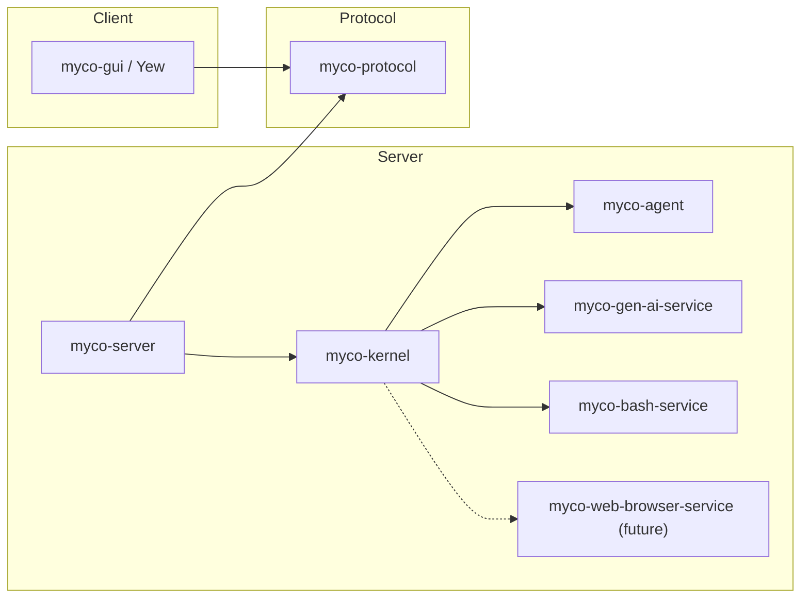

# Architecture and interfaces

Proposed contracts for the rewrite, implemented in the review sequence below.

## Crates



| Crate | Responsibility |
| --- | --- |
| `myco-agent` | Typed, pure-functional state-machine transitions governing agent logic. No effects applied directly. |
| `myco-gen-ai-service` | Single-turn inference through a concrete async `GenAiClient`; a `Config` enum selects private backend drivers. |
| `myco-bash-service` | `BashClient` API for terminals/processes, shared bash instances, operation records, cancellation, and output streams. |
| `myco-web-browser-service` (future) | Browser control and observation APIs. |
| `myco-kernel` | Async Rust API, agent tool catalog and adapters, session interpreters, branch writers, workspaces, storage, and supervision. |
| `myco-server` | HTTP adapter over the kernel: wire conversion, endpoints, streams, and application startup/shutdown. |
| `myco-protocol` | Versioned HTTP and streamed-event schemas, independent of engine types and storage formats. |
| `myco-gui` | Yew client for conversations and shared service instances. |

`myco-kernel` exposes Rust operations for event submission, state reads,
workspaces, service controls, and observation streams. It owns or re-exports the
domain types its callers need and runs without an HTTP listener. `myco-server` maps
between this API and `myco-protocol`; the kernel has no wire-protocol dependency.

Services are independent crates with APIs suited to their capabilities. There is
no common service trait or aggregate services crate. They do not depend on the
agent's session language or tool catalog.

Agent tools live in `myco-kernel`: definitions, argument schemas, and adapters
that call service APIs and translate results. GUI controls also use service APIs
through the kernel and server, sharing the same instances and observations.
Generation remains an effect whether or not the kernel also exposes it as a tool.

`GenAiClient::generate` returns `Result<Response, Error>` and awaits a fallible callback
for ordered request/progress observations. Request recording precedes dispatch.
Backend dispatch uses a private `Driver` trait; there is no public model trait.

## Session language and interpretation

`myco-agent` owns the conversation vocabulary:

| Concept | Meaning |
| --- | --- |
| Thread entry | Accepted user input, assistant content, tool invocation, or tool result. |
| `GenerationIntent` | Request a reply or compaction from a fixed state version. |
| Candidate | Proposed ordered content and completion status. |
| `GenerationFinished` | Candidate or failure, correlated with its operation and evidence. |
| `ToolInvocation` | Logical capability, complete structured arguments, and session invocation ID. |
| `ToolFinished` | Result or failure correlated with its invocation and operation. |

State, traces, and events contain session values and opaque evidence
references. Gen AI request, response, message, and tool-call types exist only at
the interpretation boundary. The kernel's generation interpreter:

1. Resolves the fixed state's instructions, context, capabilities, and policy,
   plus its versioned binding to model/backend configuration and provider options.
2. Constructs a `myco_gen_ai_service::Request` and records the resolved configuration
   and exact request before dispatch.
3. Invokes `GenAiClient`, retains observations and the outcome, and translates them
   into session events.

For `InvokeTool`, a kernel adapter validates arguments against the pinned tool
schema, calls the relevant service API, and translates the outcome into
`ToolFinished`. GUI operations use kernel service controls directly.

`agent::step` validates operation correlation, target transcript revision, and
conversation policy before accepting a candidate or requesting tools. Completion,
refusal, truncation, failure, and budget usage have session-level meanings.
Progress and incomplete tool arguments cannot authorize execution. Stale or
unselected candidates remain evidence; duplicate outcomes cannot append twice.

Interpreter records preserve native continuation, raw provider metadata, and
stable mappings between provider call IDs and session invocation IDs. These IDs
are distinct from execution operation IDs. Evidence is durable before an event
can commit a reference to it. Retained states keep their evidence reachable;
later requests restore it or report missing/incompatible continuation explicitly.
Interpreter bindings and translation versions are pinned for recovery and replay.

## State

| Type | Meaning |
| --- | --- |
| `Session` | Conversation identity, configuration, and metadata at a fixed version; groups related threads. |
| `Thread` | Ordered transcript at a fixed revision, with source lineage. |
| `State` | Owned session/thread data, phase, configuration, and operation correlations at a fixed branch revision. Updated by consuming transitions. |

State owns a dense `Vec<Thread>`; each thread owns a `Vec<Entry>`. Cloning copies
all metadata and conversation entries across every thread, including older threads
retained after compaction. A transition consumes the state, mutates its existing
buffers, and returns it. Published revisions and separately cloned values remain
unchanged. Private constructors validate the selected thread and other invariants.

```rust
#[derive(Clone)]
pub struct State {
    version: StateVersion,
    session: Session,
    threads: Vec<Thread>,
    current_thread: usize,
    phase: Phase,
}

impl State {
    pub fn version(&self) -> StateVersion;
    pub fn session(&self) -> &Session;
    pub fn threads(&self) -> &[Thread];
    pub fn thread(&self) -> &Thread;
    pub fn phase(&self) -> &Phase;
}

#[derive(Clone)]
pub enum Phase {
    Ready,
    AwaitingModel(PendingGeneration),
    AwaitingTools(PendingTools),
    Cancelling(PendingCancellation),
}
```

Accepted content can append through an internal consuming helper:

```rust
impl State {
    fn push(mut self, entry: Entry) -> Self {
        self.threads[self.current_thread].entries.push(entry);
        self
    }
}
```

`Clone` preserves identity and version; it creates no branch or running operation.
Durable lineage and interpreter evidence retain their referenced IDs and versions.
Restoring state loads its historical configuration and metadata.

The kernel owns branch writers and serializes read, step, and commit per branch
while services run concurrently. Storage checks the expected revision on commit.
Each writable thread belongs to one branch. Cloning state grants no write or
execution authority; speculative transitions can be computed freely.

## Transitions

```rust
#[derive(Clone)]
pub struct Event {
    pub id: EventId,
    pub payload: AgentEvent,
}

#[derive(Clone)]
pub enum AgentEvent {
    Start(Start),
    GenerationFinished(GenerationFinished),
    ToolFinished(ToolFinished),
    Progress(OperationProgress),
    Cancel(Cancel),
}

pub fn step(
    state: State,
    event: Event,
) -> Result<Transition, Rejected>;

pub struct Rejected {
    pub state: State,
    pub event: Event,
    pub error: StepError,
}
```

The kernel loads state before calling the pure, synchronous `agent::step`.
Reads and commits use async I/O outside the transition; time and random choices
are explicit inputs. Validate before mutation: an invalid event returns the
original state and event through `Rejected`, without effects or a defensive clone.
Service failures arrive as outcome events. An accepted generation candidate appends
to the current thread's vector during the transition.

`Phase` and `AgentEvent` are ordinary enums. Transitions validate phase/event
combinations and operation correlations at runtime. Phase payloads retain pending
operation data; `AwaitingTools` records missing observations, while the service
owns live execution status.

| Phase | Event | Successor | Effects |
| --- | --- | --- | --- |
| `Ready` | `Start` | `AwaitingModel` | Generate a reply or compact first. |
| `AwaitingModel` | `GenerationFinished` | `Ready`, `AwaitingTools`, or `AwaitingModel` | None; invoke tools; or reply after compaction. |
| `AwaitingTools` | `ToolFinished` | `AwaitingTools` or `AwaitingModel` | Generate once all required results are recorded. |
| `AwaitingModel` / `AwaitingTools` | `Cancel` | `Cancelling` | Cancel outstanding operations. |
| `Cancelling` | Terminal outcome | `Cancelling` or `Ready` | None; wait for all outstanding outcomes. |
| `Ready` / `Cancelling` | Repeated `Cancel` for the same turn | Same | None. |
| Any phase expecting an operation | Correlated progress | Same | None; retain evidence. |

Compaction selects a new thread; retained states keep their original histories.

## Effects and persistence

Effects are data with stable operation IDs across delivery retries:

```rust
pub struct Effect {
    pub id: OperationId,
    pub action: Action,
}

pub struct GenerationIntent {
    pub source: StateVersion,
    pub purpose: GenerationPurpose,
}

pub enum Action {
    Generate(GenerationIntent),
    InvokeTool(ToolInvocation),
    Cancel { target: OperationId },
}
```

`source` fixes a state revision, including the interpreter binding. It can
name the successor published by the same commit, so generation includes newly
accepted input. `ToolInvocation` resolves through its pinned capability binding.

The agent defines semantic storage contracts; the kernel supplies encodings and
storage implementations:

```rust
pub type BoxFuture<'a, T> = Pin<Box<dyn Future<Output = T> + Send + 'a>>;

pub trait StateReader: Send + Sync {
    fn read(&self, at: StateVersion) -> BoxFuture<'_, Result<State, StateError>>;
}

pub trait StateStore: StateReader {
    fn commit<'a>(
        &'a self,
        proposal: &'a Commit,
    ) -> BoxFuture<'a, Result<(), StateError>>;
}
```

`StateVersion` identifies a branch and revision. `Commit` specifies the branch,
expected revision, consumed event, successor state, trace changes, and effects.

`StateStore::commit` atomically stores the successor state, advances the branch head,
and records the event, trace changes, and durable effect outbox. Repeating an
identical event/proposal is idempotent; conflicting proposals are rejected.
Persistence precedes effect execution, including generation and tool invocation.

`Transition` holds the commit proposal. Callers can inspect or clone its proposed
state; only confirmed commit publishes it and releases executable effects:

```rust
impl Transition {
    pub fn state(&self) -> &State;
    pub fn proposal(&self) -> &Commit;

    pub async fn commit(
        self,
        store: &dyn StateStore,
    ) -> Result<(State, CommittedEffects), CommitFailure>;
}

pub struct CommitFailure {
    pub transition: Transition,
    pub error: StateError,
}
```

`CommittedEffects` has a private constructor. Failure retains the proposal for
retry or reconciliation. An ambiguous commit requires checking the event ID;
a revision conflict requires reload. Neither permits dispatch or branch advancement.

The kernel pumps events through this boundary:

```rust
let state = store.read(version).await?;
let transition = agent::step(state, event1)?;
let (state, effects) = transition.commit(&store).await?;
executor.wake(effects);

let transition = agent::step(state, event2)?;
let (state, effects) = transition.commit(&store).await?;
executor.wake(effects);
```

The executor drains the durable outbox separately from the event pump. A lost
wakeup cannot lose work.

## Cancellation and recovery

- `Cancel` names a turn and commits intent before requesting cancellation.
  The interpreter suppresses undispatched work and requests cancellation of
  dispatched work. Acknowledgement does not undo side effects or settle an
  unknown outcome.
  Dropping generation settles the local attempt as cancelled and releases its
  HTTP request, without confirming the provider stopped computing or billing.
- Commit order resolves completion/cancellation races. After cancellation commits,
  later outcomes remain evidence but cannot continue the turn. Return to `Ready`
  only after all outstanding outcomes are terminal. Claiming an effect and checking
  cancellation must be atomic; claimed requests can still race with cancellation.
  The bash service remembers cancellation by operation ID even before submission.
- Busy branches reject `Start`; the kernel may queue inputs without blocking
  outcome/cancellation events. Duplicate events do not repeat transitions. Late or
  mismatched outcomes remain linked to their original operations.
- Cancellation waits for the current bounded read/step/commit. After an aborted
  pump, reload durable state under the branch writer and reconcile any ambiguous
  commit before resuming or dispatching work.
- Retain both session traces and service records, linked by operation ID. A crash
  can leave a missing observation after a tool has completed. Query its record to
  recover the result or resume observation; unresolved work stays unresolved.
  Never blindly resubmit under a new ID. Submission deduplication cannot guarantee
  exactly-once external side effects; model providers may not deduplicate attempts.

## Runtime, forking, and evaluation

The kernel starts by validating state, acquiring branch writers, and
reconciling operations. Shutdown stops intake, finishes or reconciles commits,
applies cancellation policy, and supervises workers. The server starts the kernel
and HTTP listeners and forwards shutdown signals. Rust applications can manage
the same kernel lifecycle directly. Clients do not own branch or service lifetimes.
Agent policy defines triggers; clocks, watchers, and HTTP deliver them.

The HTTP API covers workspaces, conversations, branches, service controls, and
observations. Mutations carry deduplication IDs; acceptance and completion are separate.
Stream cursors support reconnecting clients. The Yew GUI uses this API; there is
no interactive CLI. Terminals belong to workspaces and can be shared by
humans and agents; workspace membership alone provides no filesystem isolation.

State cloning is valid in any phase. Runnable forks initially require settled
states and commit fresh branch/thread identities with source lineage and new
operation IDs. They copy all threads and history; they do not copy writers,
futures, or service instances. Making pending states runnable requires an explicit
policy for their outstanding operations; restoring the original branch reconciles
existing IDs.

Search can generate and score independent candidates from the same state,
then select a continuation or fork. Branches must isolate tool workspaces or defer
tool effects until selection. The ordinary agent keeps its single-generation policy.

Evaluations use pure transitions with state fixtures or the kernel's Rust API
with budgets, interpreters, and graders. Neither needs an HTTP server. Scripted
session events need no service dependencies. Real interpreters retain exact inputs,
outcomes, and tool evidence. GEPA consumes trial scores, traces, and diagnostic feedback.

## Review sequence

1. **Interfaces:** crate boundaries, session language, state, transitions,
   commit semantics, and recovery.
2. **Gen AI service:** `GenAiClient` and private drivers; local HTTP fixtures for
   awaited observations, native continuation, incomplete outcomes, and cancellation.
3. **Agent:** owned vector state, enum-based transitions, in-memory store,
   scripted events, and bounded compaction. Check independent clones, determinism,
   invalid phase/event rejection, commit gating, cancellation, and duplicates.
4. **Bash service:** `BashClient`, shared terminal, output streams, durable operation
   records, cancellation, deduplication, and worker supervision.
5. **Kernel:** Rust API, agent tool catalog/adapters, interpreters, durable storage,
   delivery, reconciliation, and shutdown. Test fixed-context request construction,
   argument validation, outcome translation, continuation restoration, and
   invocation-ID mapping without HTTP.
6. **Server/protocol:** HTTP schemas, endpoints, and streams over the kernel API.
7. **GUI:** session/thread browsing and shared service controls in Yew.
8. **Evaluation/GEPA:** isolated task fixtures and inspectable optimizer feedback.
