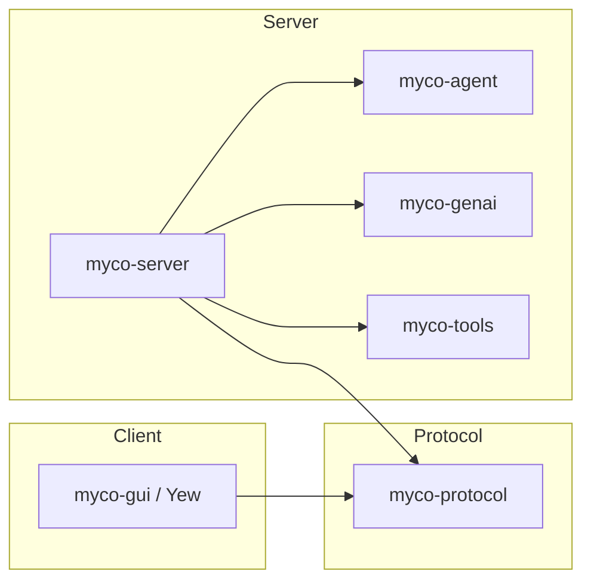

# Architecture and interfaces

Proposed contracts for the rewrite, implemented in the review sequence below.

## Crates



| Crate | Responsibility |
| --- | --- |
| `myco-agent` | Session language, immutable checkpoints, typed transitions, context selection, autocompaction, and persistence contracts. |
| `myco-genai` | One inference attempt through a concrete async `Client`; a `Config` enum selects private backend drivers. |
| `myco-tools` | Shared tool instances, workers, operation records, and observation streams through `Harness`. |
| `myco-server` | Session interpreters, branch writers, workspaces, storage, event delivery, supervision, and HTTP endpoints. |
| `myco-protocol` | Versioned HTTP and streamed-event schemas, independent of engine types and storage formats. |
| `myco-gui` | Yew client for conversations and shared tools. |

`myco-agent`, `myco-genai`, and `myco-tools` are independent. The server translates
between their types and the wire protocol. Services execute capabilities; tools
expose capabilities to a model. Generation is an effect regardless of whether it
is also exposed as a tool.

`Client::generate` returns `Result<Response, Error>` and awaits a fallible callback
for ordered request/progress observations. Request recording precedes dispatch.
Backend dispatch uses a private `Driver` trait; there is no public model trait.

## Session language and interpretation

`myco-agent` owns the conversation vocabulary:

| Concept | Meaning |
| --- | --- |
| Thread entry | Accepted user input, assistant content, tool invocation, or tool result. |
| `GenerationIntent` | Request a reply or compaction from a fixed checkpoint. |
| Candidate | Proposed ordered content and completion status. |
| `GenerationFinished` | Candidate or failure, correlated with its operation and evidence. |
| `ToolInvocation` | Logical capability, complete structured arguments, and session invocation ID. |
| `ToolFinished` | Result or failure correlated with its invocation and operation. |

Checkpoints, traces, and events contain session values and opaque evidence
references. Genai request, response, message, and tool-call types exist only at
the interpretation boundary. The server's generation interpreter:

1. Resolves the fixed checkpoint's instructions, context, capabilities, and policy,
   plus its versioned binding to model/backend configuration and provider options.
2. Constructs a `myco_genai::Request` and records the resolved configuration and
   exact request before dispatch.
3. Invokes `Client`, retains observations and the outcome, and translates them
   into session events. Tool services follow the same interpretation boundary.

`agent::step` validates operation correlation, target transcript revision, and
conversation policy before accepting a candidate or requesting tools. Completion,
refusal, truncation, failure, and budget usage have session-level meanings.
Progress and incomplete tool arguments cannot authorize execution. Stale or
unselected candidates remain evidence; duplicate outcomes cannot append twice.

Interpreter records preserve native continuation, raw provider metadata, and
stable mappings between provider call IDs and session invocation IDs. These IDs
are distinct from execution operation IDs. Evidence is durable before an event
can commit a reference to it. Retained checkpoints keep their evidence reachable;
later requests restore it or report missing/incompatible continuation explicitly.
Interpreter bindings and translation versions are pinned for recovery and replay.

## Checkpoints and ownership

| Type | Meaning |
| --- | --- |
| `Session` | Conversation identity, configuration, and metadata at a fixed version; groups related threads. |
| `Thread` | Ordered transcript at a fixed revision, with source lineage. |
| `Checkpoint<P>` | Immutable session/thread snapshots, phase, configuration, and operation correlations. Cloneable data. |
| `State<P>` | Checkpoint plus exclusive authority to advance one branch. Neither `Clone` nor `Copy`. |

Private constructors validate consistent snapshots. A checkpoint selects its own
current thread. Cloning preserves identity and version without acquiring a writer
or starting work. Appends create new tails pointing backward to immutable history;
`Arc`, chunking, and collection layout remain private choices. Durable references
use IDs and versions, so compaction can retain lineage without keeping old history
resident. Restoring a checkpoint loads its historical configuration and metadata.

```rust
pub struct Checkpoint<P> {
    snapshot: Snapshot<P>,
}

impl<P> Checkpoint<P> {
    pub fn session(&self) -> &Session;
    pub fn thread(&self) -> &Thread;
    pub fn phase(&self) -> &P;
}

pub struct State<P> {
    checkpoint: Checkpoint<P>,
    owner: BranchOwner,
}

impl<P> State<P> {
    pub fn checkpoint(&self) -> &Checkpoint<P>;
}
```

`agent::step` consumes the owner when its future is constructed. Each branch
processes one event at a time; independent branches and services run concurrently.
The server enforces one writer per branch, validates restored checkpoints, and
checks the expected revision on commit. Each writable thread belongs to one branch.
Rust ownership alone cannot enforce exclusivity across independently loaded copies
of the same branch.

## Transitions

```rust
pub trait Step<E>: Sized + Send + private::Sealed {
    type Next: Send;

    fn step(
        self,
        event: Event<E>,
        reader: &dyn StateReader,
    ) -> impl Future<Output = Result<Transition<Self::Next>, Rejected<Self, E>>> + Send;
}

pub struct Rejected<S, E> {
    pub state: S,
    pub event: Event<E>,
    pub error: StepError,
}
```

The stateless entry point delegates to sealed implementations:

```rust
pub async fn step<S, E>(
    state: S,
    event: Event<E>,
    reader: &dyn StateReader,
) -> Result<Transition<S::Next>, Rejected<S, E>>
where
    S: Step<E>,
    E: Send,
{
    state.step(event, reader).await
}
```

`Event<E>` pairs a stable ID with its payload. A step may await bounded reads of
fixed state versions; it never waits for a model, tool, clock, or another event.
Writes are returned as data. Time and random choices are explicit inputs for
replay. Invalid events and failed reads return the unchanged owner and event
without effects. Service failures arrive as ordinary outcome events.

Phases carry correlations to expected outcomes. `AwaitingTools` records which
observations are missing; the tool service owns live execution status.

| Phase | Event | Successor | Effects |
| --- | --- | --- | --- |
| `Ready` | `Start` | `AwaitingModel` | Generate a reply or compact first. |
| `AwaitingModel` | `GenerationFinished` | `Ready`, `AwaitingTools`, or `AwaitingModel` | None; invoke tools; or reply after compaction. |
| `AwaitingTools` | `ToolFinished` | `AwaitingTools` or `AwaitingModel` | Generate once all required results are recorded. |
| `AwaitingModel` / `AwaitingTools` | `Cancel` | `Cancelling` | Cancel outstanding operations. |
| `Cancelling` | Terminal outcome | `Cancelling` or `Ready` | None; wait for all outstanding outcomes. |
| `Ready` / `Cancelling` | Repeated `Cancel` for the same turn | Same | None. |
| Any phase expecting an operation | Correlated progress | Same | None; retain evidence. |

`Step<Start> for State<Ready>` has `Next = State<AwaitingModel>`; there is no
`Step<GenerationFinished> for State<Ready>`. Branching successors use an enum:

```rust
pub enum AfterGeneration {
    Ready(State<Ready>),
    Tools(State<AwaitingTools>),
    Model(State<AwaitingModel>),
}
```

Callers match the successor before taking another typed step. Turn/operation IDs,
pending results, and candidate contents require runtime checks. Compaction commits
a new thread; retained checkpoints keep their original histories.

`RuntimeState` routes an `AgentEvent` enum through the same typed implementations.
An optional dynamic facade supports heterogeneous owners and preserves the boxed
owner on rejection:

```rust
pub type BoxFuture<'a, T> = Pin<Box<dyn Future<Output = T> + Send + 'a>>;
pub type DynStepResult = Result<
    Transition<Box<dyn DynState>>,
    Rejected<Box<dyn DynState>, AgentEvent>,
>;

pub trait DynState: Send {
    fn step<'a>(
        self: Box<Self>,
        event: Event<AgentEvent>,
        reader: &'a dyn StateReader,
    ) -> BoxFuture<'a, DynStepResult>
    where
        Self: 'a;
}
```

No state-machine library is selected. Implementations must support ownership
recovery, branching successors, and commit gating without executing effects
inside transitions.

## Effects and persistence

Effects are data with stable operation IDs across delivery retries:

```rust
pub struct Effect {
    pub id: OperationId,
    pub action: Action,
}

pub struct GenerationIntent {
    pub source: StateVersion,
    pub purpose: GenerationPurpose,
}

pub enum Action {
    Generate(GenerationIntent),
    InvokeTool(ToolInvocation),
    Cancel { target: OperationId },
}
```

`source` fixes a checkpoint revision, including the interpreter binding. It can
name the successor published by the same commit, so generation includes newly
accepted input. `ToolInvocation` resolves through its pinned capability binding.

The agent defines semantic storage contracts; the server supplies encodings and
storage implementations:

```rust
pub trait StateReader: Send + Sync {
    fn read(&self, at: StateVersion) -> BoxFuture<'_, Result<StateView, StateError>>;
}

pub trait StateStore: StateReader {
    fn commit<'a>(
        &'a self,
        proposal: &'a Commit,
    ) -> BoxFuture<'a, Result<(), StateError>>;
}
```

`StateVersion` identifies a branch and checkpoint revision. `StateView` resolves
its immutable session, thread, and trace data. `Commit` specifies the branch,
expected revision, consumed event, successor checkpoint, trace changes, and effects.

`StateStore::commit` atomically publishes snapshots, advances the branch head,
and records the event, trace changes, and durable effect outbox. Repeating an
identical event/proposal is idempotent; conflicting proposals are rejected.
Persistence precedes effect execution, including generation and tool invocation.

`Transition<Next>` privately holds the proposal and successor owner. Inspection
borrows the proposal; only confirmed commit releases ownership and executable
effects:

```rust
impl<Next> Transition<Next> {
    pub fn proposal(&self) -> &Commit;

    pub async fn commit(
        self,
        store: &dyn StateStore,
    ) -> Result<(Next, CommittedEffects), CommitFailure<Next>>;
}

pub struct CommitFailure<Next> {
    pub transition: Transition<Next>,
    pub error: StateError,
}
```

`CommittedEffects` has a private constructor. Failure retains the proposal for
retry or reconciliation. An ambiguous commit requires checking the event ID;
a revision conflict requires reload. Neither allows dispatch or continued stepping.

With `RuntimeState: Step<AgentEvent>`:

```rust
let transition = agent::step(state, event1, &store).await?;
let (state, effects) = transition.commit(&store).await?;
executor.wake(effects);

let transition = agent::step(state, event2, &store).await?;
let (state, effects) = transition.commit(&store).await?;
executor.wake(effects);
```

The executor drains the durable outbox separately from the event pump. A lost
wakeup cannot lose work.

## Cancellation and recovery

- `Cancel` names a turn and commits intent before requesting cancellation.
  The interpreter suppresses undispatched work and requests cancellation of
  dispatched work. Acknowledgement does not undo side effects or settle an
  unknown outcome.
  Dropping generation settles the local attempt as cancelled and releases its
  HTTP request, without confirming the provider stopped computing or billing.
- Commit order resolves completion/cancellation races. After cancellation commits,
  later outcomes remain evidence but cannot continue the turn. Return to `Ready`
  only after all outstanding outcomes are terminal. Claiming an effect and checking
  cancellation must be atomic; claimed requests can still race with cancellation.
  Tools remember cancellation by operation ID even before submission.
- Busy branches reject `Start`; the server may queue inputs without blocking
  outcome/cancellation events. Duplicate events do not repeat transitions. Late or
  mismatched outcomes remain linked to their original operations.
- Cancellation waits for the current bounded step/commit. Dropping a consuming
  future loses the owner: reload and reacquire the writer, reconciling any ambiguous
  commit first. Checkpoint clones cannot substitute for that authority.
- Retain both session traces and service records, linked by operation ID. A crash
  can leave a missing observation after a tool has completed. Query its record to
  recover the result or resume observation; unresolved work stays unresolved.
  Never blindly resubmit under a new ID. Submission deduplication cannot guarantee
  exactly-once external side effects; model providers may not deduplicate attempts.

## Runtime, forking, and evaluation

Startup validates checkpoints, acquires branch writers, and reconciles operations
before pumping events. Shutdown stops intake, finishes or reconciles commits,
applies cancellation policy, and supervises workers. Clients do not own branch
or tool lifetimes. Agent policy defines triggers; clocks, watchers, and HTTP
deliver them.

The HTTP API covers workspaces, conversations, branches, tools, and observations.
Mutations carry deduplication IDs; acceptance and completion are separate.
Stream cursors support reconnecting clients. The Yew GUI uses this API; there is
no interactive CLI. Tool instances belong to workspaces and can be shared by
humans and agents; workspace membership alone provides no filesystem isolation.

Checkpoint cloning is valid in any phase. Runnable forks initially require settled
checkpoints and commit fresh branch/thread identities with source lineage and new
operation IDs. They share immutable history, never writer authority, futures, or
live tools. Making pending checkpoints runnable requires an explicit policy for
their outstanding operations; restoring the original branch reconciles existing IDs.

Search can generate and score independent candidates from the same checkpoint,
then select a continuation or fork. Branches must isolate tool workspaces or defer
tool effects until selection. The ordinary agent keeps its single-generation policy.

Evaluations use the same transitions with candidate configuration, state fixtures,
budgets, and graders. An in-memory store and scripted session events need no genai
or tool-service dependency. Real interpreters retain exact inputs, outcomes, and
tool evidence. GEPA consumes trial scores, traces, and diagnostic feedback.

## Review sequence

1. **Interfaces:** crate boundaries, session language, checkpoints, transitions,
   commit semantics, and recovery.
2. **Genai:** concrete client and private drivers; local HTTP fixtures for awaited
   observations, native continuation, incomplete outcomes, and cancellation.
3. **Agent:** immutable snapshots, typed transitions, in-memory store, scripted
   interpreter, and bounded compaction. Check snapshot retention, ownership,
   typed/dynamic parity, commit gating, cancellation, duplicates, and recovery.
4. **Tools:** shared terminal, human/agent observers, durable operation records,
   cancellation, deduplication, and worker supervision.
5. **Server/protocol:** interpreters, durable storage, delivery, reconciliation,
   and shutdown. Test fixed-context request construction, outcome translation,
   continuation restoration, and invocation-ID mapping.
6. **GUI:** session/thread browsing and shared tools in Yew.
7. **Evaluation/GEPA:** isolated task fixtures and inspectable optimizer feedback.
