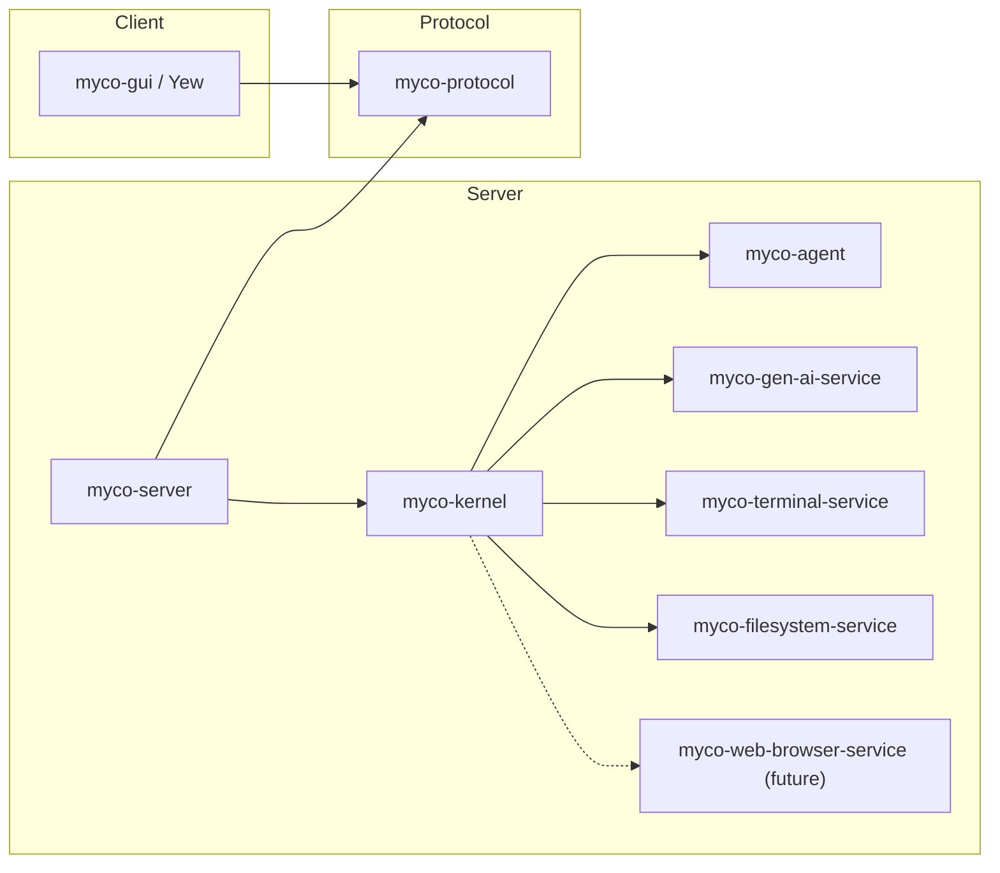

# Architecture and interfaces

Proposed contracts for the rewrite, implemented in the review sequence below.

## Crates



| Crate | Responsibility |
| --- | --- |
| `myco-agent` | Conversation state and synchronous state-machine methods that mutate state and return explicit effects. |
| `myco-gen-ai-service` | Single-turn inference through a concrete async `GenAiClient`; a `Config` enum selects private backend drivers. |
| `myco-terminal-service` | `TerminalClient` API for shared terminals/processes, operation records, cancellation, and output streams. |
| `myco-filesystem-service` | `FilesystemClient` API for reading, creating, and editing files with version checks. |
| `myco-web-browser-service` (future) | Browser control and observation APIs. |
| `myco-kernel` | Agent runtimes, tool adapters, interpretation, persistence, supervision, workspace routing, and service discovery. |
| `myco-server` | HTTP adapter over the kernel: wire conversion, endpoints, streams, and application startup/shutdown. |
| `myco-protocol` | Versioned HTTP and streamed-event schemas, independent of engine types and storage formats. |
| `myco-gui` | Yew client for conversations and shared service instances. |

`myco-kernel` exposes Rust operations for agent creation, messaging, state reads,
workspaces, service discovery/controls, and observation streams. It owns or
re-exports the domain types its callers need and runs without an HTTP listener.
`myco-server` maps between this API and `myco-protocol`; the kernel has no
wire-protocol dependency.

Services are independent crates with APIs suited to their capabilities. There is
no common service trait or aggregate services crate. They do not depend on the
agent's session language or tool catalog.

Agent tools live in `myco-kernel`: definitions, argument schemas, and adapters
that call service APIs or internal kernel operations and translate results. GUI
controls also use service APIs through the kernel and server, sharing the same
instances and observations.
Generation remains an effect whether or not the kernel also exposes it as a tool.

`GenAiClient::generate` returns `Result<Response, Error>` and awaits a fallible callback
for ordered request/progress observations. Request recording precedes dispatch.
Backend dispatch uses a private `Driver` trait; there is no public model trait.

## Workspaces and service APIs

The kernel registers service instances within workspaces. Discovery lists instance
IDs, service kinds, and API versions; resolution checks the workspace and expected
kind before returning a bound client. A binding identifies the instance and its
configuration, including host and working directory/root where applicable.
Different services keep their own request/result types. The kernel maps operation
IDs into service records and pins bindings for retries; discovery never silently
substitutes another instance for an unavailable target.

Agents run within the kernel, using `myco-agent` for transitions. Supervisor and
subagent are roles of ordinary agents, with parent/child metadata. Kernel tools
can create, fork, message, inspect, or cancel another agent in the workspace.
Creation is deduplicated by operation ID; message acceptance and the recipient's
eventual response are separate observations. These tools call kernel operations
directly. Inference remains the responsibility of `myco-gen-ai-service`.

### Terminal

`TerminalClient` addresses a workspace-bound service instance. Processes have
stable `ProcessId`s independent of agent conversations:

```rust
impl TerminalClient {
    pub async fn start(&self, request: StartProcess) -> Result<ProcessId, TerminalError>;
    pub async fn control(&self, request: ControlProcess) -> Result<ControlReceipt, TerminalError>;
    pub async fn read(&self, request: ReadOutput) -> Result<OutputPage, TerminalError>;
    pub async fn list(&self) -> Result<Vec<ProcessInfo>, TerminalError>;
    pub async fn inspect(&self, process: ProcessId) -> Result<ProcessInfo, TerminalError>;
    pub async fn operation(&self, id: OperationId) -> Result<OperationRecord, TerminalError>;
}
```

`StartProcess` supplies an operation ID, command, working directory, environment,
and pipe or PTY mode. Start returns after durable acceptance; process exit is
observed later. `ControlProcess` carries its own operation ID and a command:
write input, resize a PTY, signal, close/reap, or cancel a target operation.
Cancellation can arrive before start; repeated identical requests reuse their
records. Writes are serialized per process, and receipts report partial delivery.
An input receipt does not imply that a command finished.

`ReadOutput` supplies a cursor, byte limit, and bounded wait. `OutputPage` contains
bytes tagged by stream, the next cursor, retention gaps, process status, and
end-of-output status; PTY output is merged. Readers have independent cursors, so
a GUI and several agents do not consume each other's output. Slow readers cannot block process
draining. Exit status includes code or signal; an idle wait is not an exit.
Lost workers require reconciliation, not a claim that process state was restored.

The kernel's `bash` adapter builds finite execution and interactive waits from
these operations. GUI terminals use the same process IDs and output records.
Processes belong to the workspace and survive client disconnects and compaction.

### Filesystem

`FilesystemClient` exposes file operations independently of agent tool schemas:

```rust
impl FilesystemClient {
    pub async fn read(&self, request: ReadFile) -> Result<FileContent, FilesystemError>;
    pub async fn list(&self, request: ListDirectory) -> Result<DirectoryPage, FilesystemError>;
    pub async fn create(&self, request: CreateFile) -> Result<FileVersion, FilesystemError>;
    pub async fn edit(&self, request: EditFile) -> Result<FileVersion, FilesystemError>;
    pub async fn operation(&self, id: OperationId) -> Result<EditRecord, FilesystemError>;
}
```

Reads return bounded bytes or a text range, explicit truncation, and a version of
the whole file; directory listings are paginated. Mutations carry operation IDs.
Create requires an absent path. Edit requires an expected file version and selects
literal replacement, insertion after a line, or whole-file write for GUI saves.
Replacement requires a nonempty search string with exactly one match; insertion
uses one-based lines, with zero meaning the beginning of the file.

The kernel's `str_replace_based_edit_tool` adapter maps view/create/replace/insert
onto these operations. It supplies the expected version from that agent's recorded
read or successful mutation. GUI saves supply their own observed version. File
versions are explicit API values, not a service-side per-agent read cache.

The service serializes edits to each resolved target, rejects stale versions, and
publishes complete files atomically while preserving permissions and symlink
targets. Version checks detect observed external changes; they cannot exclude
arbitrary writers that bypass the service. Records retain mutation intent and
before/after versions for reconciliation; an ambiguous insert is not blindly
replayed. Filesystem and terminal bindings can address the same host/files.

## Session language and interpretation

`myco-agent` owns the conversation vocabulary:

| Concept | Meaning |
| --- | --- |
| Thread entry | Accepted user input, assistant content, tool invocation, or tool result. |
| `GenerationIntent` | Target thread, agent-selected instructions, and context from fixed history versions. |
| Candidate | Proposed ordered content and completion status. |
| `GenerationFinished` | Candidate or failure, correlated with its operation and evidence. |
| `ToolInvocation` | Logical capability, complete structured arguments, and session invocation ID. |
| `ToolFinished` | Result or failure correlated with its invocation and operation. |

State, traces, and events contain session values and opaque evidence
references. Gen AI request, response, message, and tool-call types exist only at
the interpretation boundary. The kernel's generation interpreter:

1. Resolves the agent's selected instructions, history references, and capabilities,
   plus the fixed state's binding to model/backend configuration and provider options.
2. Constructs a `myco_gen_ai_service::Request` and records the resolved configuration
   and exact request before dispatch.
3. Invokes `GenAiClient`, retains observations and the outcome, and translates them
   into session events.

For `InvokeTool`, a kernel adapter validates arguments against the pinned tool
schema, calls a service API or internal kernel operation, and translates the
outcome into `ToolFinished`. GUI operations use kernel service controls directly.

`State::step` validates operation correlation, target transcript revision, and
conversation policy before accepting a candidate or requesting tools. Completion,
refusal, truncation, failure, and budget usage have session-level meanings.
Progress and incomplete tool arguments cannot authorize execution. Stale or
unselected candidates remain evidence; duplicate outcomes cannot append twice.

Interpreter records preserve native continuation, raw provider metadata, and
stable mappings between provider call IDs and session invocation IDs. These IDs
are distinct from execution operation IDs. Evidence is durable before an event
can commit a reference to it. Retained states keep their evidence reachable;
later requests restore it or report missing/incompatible continuation explicitly.
Interpreter bindings and translation versions are pinned for recovery and replay.
Native continuation is reusable only when it represents the selected context.

## State

| Type | Meaning |
| --- | --- |
| `Session` | Conversation identity, configuration, and metadata at a fixed version; groups related threads. |
| `Thread` | Ordered transcript, its revision, phase, pending operations, and source lineage. |
| `State` | Owned session and threads, with one foreground thread. Methods mutate the working state; cloning copies it. |

State owns a dense `Vec<Thread>`; each thread owns a `Vec<Entry>`. Cloning copies
all metadata and conversation entries across every thread, including older threads
retained after compaction. Methods take `&mut self` and update the existing buffers.
Callers explicitly clone when they need to preserve or explore a separate value.
Published revisions and separately cloned values remain unchanged. Private
constructors validate the selected thread and other invariants.

```rust
#[derive(Clone)]
pub struct State {
    version: StateVersion,
    session: Session,
    threads: Vec<Thread>,
    foreground: ThreadId,
}

impl State {
    pub fn version(&self) -> StateVersion;
    pub fn session(&self) -> &Session;
    pub fn threads(&self) -> &[Thread];
    pub fn thread(&self, id: ThreadId) -> Option<&Thread>;
    pub fn foreground(&self) -> &Thread;
}

#[derive(Clone)]
pub struct Thread {
    id: ThreadId,
    revision: ThreadRevision,
    entries: Vec<Entry>,
    phase: Phase,
    origin: Option<HistoryRef>,
}

impl Thread {
    pub fn id(&self) -> ThreadId;
    pub fn revision(&self) -> ThreadRevision;
    pub fn entries(&self) -> &[Entry];
    pub fn phase(&self) -> &Phase;
}

#[derive(Clone)]
pub enum Phase {
    Ready,
    AwaitingModel(PendingGeneration),
    AwaitingTools(PendingTools),
    Compacting(PendingCompaction),
    Cancelling(PendingCancellation),
    Archived,
}
```

Accepted content appends through an ordinary internal helper:

```rust
impl Thread {
    fn push(&mut self, entry: Entry) {
        self.entries.push(entry);
    }
}
```

`Clone` preserves identity and version; it creates no branch or running operation.
Durable lineage and interpreter evidence retain their referenced IDs and versions.
Restoring state loads its historical configuration and metadata.

The kernel owns branch writers and serializes read, step, and commit per branch
while services run concurrently. Storage checks the expected revision on commit.
Each writable thread belongs to one branch. Cloning state grants no write or
execution authority; speculative transitions can be computed freely.

## Transitions

```rust
#[derive(Clone)]
pub struct Event {
    pub id: EventId,
    pub thread: ThreadId,
    pub payload: AgentEvent,
}

#[derive(Clone)]
pub enum AgentEvent {
    Start(Start),
    GenerationFinished(GenerationFinished),
    ToolFinished(ToolFinished),
    Progress(OperationProgress),
    Cancel(Cancel),
}

impl State {
    pub fn step(&mut self, event: &Event) -> Result<Vec<Effect>, StepError>;
}
```

The kernel loads a working state and calls `State::step`. The method validates the
whole event before mutation, updates state and its working revision in place, and
returns the requested effects. Rejection leaves state unchanged and requests no
work, without a defensive clone. Time and random choices are explicit inputs.
The agent calls no services or injected handlers; reads, commits, and execution
belong to the kernel.

An accepted generation candidate appends to its target thread's vector. Transcript
changes advance that thread's revision; any accepted event advances the state
revision. Service results arrive as later events. Rust's mutable borrow prevents
overlapping calls on the same value; the kernel's branch writer spans the complete
read/step/commit cycle, including async I/O. Cloned values still require commit
revision checks.

`Phase` belongs to each thread. Transitions validate its event, pending operation
ID, and transcript revision. Sibling thread progress can advance `StateVersion`
without invalidating a pending generation. State revision checks still serialize
commits. `AwaitingTools` records missing observations; the service owns live status.

| Phase | Event | Successor | Effects |
| --- | --- | --- | --- |
| `Ready` | `Start` | `AwaitingModel` or `Compacting` | Generate a reply or start a compaction thread. |
| `AwaitingModel` | `GenerationFinished` | `Ready`, `AwaitingTools`, or `Archived` | Finish a reply, invoke tools, or complete compaction. |
| `AwaitingTools` | `ToolFinished` | `AwaitingTools`, `AwaitingModel`, or `Compacting` | Once all results are recorded, reply or compact first. |
| `Compacting` | Working thread completes | `Archived` | Publish a new foreground thread and resume generation there. |
| `Compacting` | Working thread fails | `Ready` | Retain the source and report failure. |
| `AwaitingModel` / `AwaitingTools` / `Compacting` | `Cancel` | `Cancelling` | Cancel outstanding operations, including compaction work. |
| `Cancelling` | Terminal outcome | `Cancelling` or `Ready` | None; wait for all outstanding outcomes. |
| `Ready` / `Cancelling` | Repeated `Cancel` for the same turn | Same | None. |
| Any phase expecting an operation | Correlated progress | Same | None; retain evidence. |

One event may update its target and related threads, such as finishing a compaction
worker and publishing its parent's successor. Validate the whole transition before
mutating any thread. Archived transcripts accept no new content.

## Context and compaction

A thread is stored history; generation context is an agent-selected view. The
agent supplies the instructions and additional history inputs. The kernel renders
the target thread's conversation and resolves those inputs without choosing the
compaction prompt or deciding what to summarize.

Inline history is quoted source material, not replayed as new live turns. Readable
history is advertised by name through a history-reading tool. The interpreter
binds that name to a concrete locator, such as a path; its durable identity is the
fixed history reference. Resolving a readable input does not insert its full text
into the prompt. The history-reading tool authorizes only advertised references.

For compaction, the agent freezes the source transcript at a settled boundary and
creates a working thread. The source's `PendingCompaction` retains the worker ID,
fixed source range, and the suffix to preserve. The worker uses ordinary generation
and tool events with an agent-selected prompt and inline or readable source history.

When the worker finishes, the agent seeds a new foreground thread with its summary
and the preserved suffix, then resumes generation. Context cuts preserve complete
tool invocation/result groups. Source and worker histories remain archived. Failure
or cancellation keeps the source foreground and its entries intact, returning it
to `Ready` after outstanding operations settle. Cancellation cannot publish a
summary or resume the cancelled turn. Other threads can continue while this work is
pending; all transitions still pass through one state writer.

## Effects and persistence

Effects are data with stable operation IDs across delivery retries:

```rust
pub struct Effect {
    pub id: OperationId,
    pub action: Action,
}

pub struct GenerationIntent {
    pub source: StateVersion,
    pub thread: ThreadId,
    pub purpose: GenerationPurpose,
    pub instructions: String,
    pub context: Vec<HistoryInput>,
}

#[derive(Clone)]
pub struct HistoryRef {
    pub state: StateVersion,
    pub thread: ThreadId,
    pub entries: std::ops::Range<usize>,
}

pub enum HistoryInput {
    Inline(HistoryRef),
    Readable { name: String, history: HistoryRef },
}

pub enum Action {
    Generate(GenerationIntent),
    InvokeTool(ToolInvocation),
    Cancel { target: OperationId },
}
```

`source` fixes the target conversation and interpreter binding; history inputs
can reference other threads and versions. It can name the successor published by
the same commit, so generation includes newly accepted input. Pending generation
records its target transcript revision as well as its operation ID.
`ToolInvocation` resolves through its pinned capability binding.

The kernel owns persistence and dispatch. A commit borrows the proposed state
and its effects, keeping them unchanged during async storage:

```rust
pub struct Commit<'a> {
    pub expected: StateVersion,
    pub event: &'a Event,
    pub state: &'a State,
    pub effects: &'a [Effect],
}
```

`Commit`, `Store`, and `CommittedEffects` belong to `myco-kernel`. The agent has
no storage dependency or serialization format:

```rust
impl Store {
    pub async fn read(&self, at: StateVersion) -> Result<State, StateError>;

    pub async fn commit(
        &self,
        proposal: &Commit<'_>,
    ) -> Result<CommittedEffects, StateError>;
}
```

`StateVersion` identifies a branch and revision. Commit checks the expected
revision, stores the successor state, advances the branch head, and records the
event, trace changes, and effects in a durable outbox atomically. Operation IDs
are stable across retries. Repeating an identical event/proposal is idempotent;
conflicting proposals are rejected.

Returned effects are requests. Only confirmed commit yields `CommittedEffects`,
whose constructor is private to the kernel; the executor accepts this handle.
Persistence precedes execution, including generation and tool invocation.

The kernel keeps the mutated state private until commit succeeds. On storage
failure it retains the exact proposal for retry or discards it and reloads durable
state before processing another event. An ambiguous commit requires checking the
event ID; a revision conflict requires reload. No local mutation proves that a
revision committed.

```rust
let mut state = store.read(version).await?;
let expected = state.version();
let effects = state.step(&event)?;
let proposal = Commit {
    expected,
    event: &event,
    state: &state,
    effects: &effects,
};
executor.wake(store.commit(&proposal).await?);
```

The executor drains the durable outbox independently. A lost wakeup cannot lose
work. The kernel's async loop selects ready service outcomes or incoming input,
including cancellation, and applies one event at a time. It does not await
operations in submission order or let progress streams starve control input.
The server submits input and supervises this loop; it does not drive individual
operation completions. Live futures stay outside `State`.

Inputs and observations are durable before delivery, and events remain
unacknowledged until their transitions commit. Dropping an idle wait cannot lose
an event or cancel an operation; recovery reconciles service records and resumes
observation.

## Cancellation and recovery

- `Cancel` names a turn and commits intent before requesting cancellation.
  The interpreter suppresses undispatched work and requests cancellation of
  dispatched work. Acknowledgement does not undo side effects or settle an
  unknown outcome.
  Dropping generation settles the local attempt as cancelled and releases its
  HTTP request, without confirming the provider stopped computing or billing.
- Commit order resolves completion/cancellation races. After cancellation commits,
  later outcomes remain evidence but cannot continue the turn. Return to `Ready`
  only after all outstanding outcomes are terminal. Claiming an effect and checking
  cancellation must be atomic; claimed requests can still race with cancellation.
  The terminal service remembers cancellation by operation ID even before submission.
- Busy threads reject `Start`; the kernel may queue inputs without blocking
  outcome/cancellation events. Duplicate events do not repeat transitions. Late or
  mismatched outcomes remain linked to their original operations.
- Cancellation wakes the kernel's idle wait and otherwise follows the current
  bounded read/step/commit. After an aborted pump, reload durable state under the
  branch writer and reconcile any ambiguous commit before resuming or dispatching
  work.
- Retain both session traces and service records, linked by operation ID. A crash
  can leave a missing observation after a tool has completed. Query its record to
  recover the result or resume observation; unresolved work stays unresolved.
  Never blindly resubmit under a new ID. Submission deduplication cannot guarantee
  exactly-once external side effects; model providers may not deduplicate attempts.

## Runtime, forking, and evaluation

The kernel starts by resolving workspace service bindings, validating state,
acquiring branch writers, and reconciling operations. Shutdown stops intake,
finishes or reconciles commits, applies cancellation policy, and supervises
workers. The server starts the kernel and HTTP listeners and forwards shutdown
signals. Rust applications can manage
the same kernel lifecycle directly. Clients do not own branch or service lifetimes.
Agent policy defines triggers; clocks, watchers, and HTTP deliver them.

The HTTP API covers workspaces, conversations, branches, service controls, and
observations. Mutations carry deduplication IDs; acceptance and completion are separate.
Stream cursors support reconnecting clients. The Yew GUI uses this API; there is
no interactive CLI. Terminals belong to workspaces and can be shared by
humans and agents; workspace membership alone provides no filesystem isolation.

State cloning is valid in any phase. Runnable forks initially require settled
states and commit fresh branch/thread identities with source lineage and new
operation IDs. They copy all threads and history; they do not copy writers,
futures, or service instances. Making pending states runnable requires an explicit
policy for their outstanding operations; restoring the original branch reconciles
existing IDs.

Search can create candidate threads from a fixed source and generate concurrently,
then select a continuation. Per-thread correlations keep results separate. Cloning
`State` instead copies the whole agent for an independent branch. Candidates must
isolate tool workspaces or defer tool effects until selection; the default reply
policy uses one foreground conversation.

Evaluations call state methods with scripted events and assert both the updated
state and returned effects, or use the kernel's Rust API with budgets, interpreters,
and graders. Neither needs an HTTP server. Scripted session events need no service
dependencies. Real interpreters retain exact inputs, outcomes, and tool evidence.
GEPA consumes trial scores, traces, and diagnostic feedback.

## Review sequence

1. **Interfaces:** crate boundaries, session language, state, transitions,
   commit semantics, and recovery.
2. **Gen AI service:** `GenAiClient` and private drivers; local HTTP fixtures for
   awaited observations, native continuation, incomplete outcomes, and cancellation.
3. **Agent:** owned vector state, mutable methods, explicit effects, scripted
   events, and bounded compaction. Check independent clones, unchanged state on
   rejection, sibling completion correlation, context selection, compaction
   success/failure/cancellation, and duplicates.
4. **Terminal service:** `TerminalClient`, shared processes, cursor-based output,
   cancellation, deduplication, and worker supervision. Check independent readers,
   input ordering, PTY controls, and worker loss.
5. **Filesystem service:** `FilesystemClient`, bounded reads, create/edit, and
   operation records. Check stale edits, ambiguous matches, symlink targets,
   create conflicts, and recovery after interrupted writes.
6. **Kernel:** Rust API, agent tool catalog/adapters, interpreters, durable storage,
   delivery, reconciliation, and shutdown. Test fixed-context request construction,
   argument validation, outcome translation, continuation restoration, and
   invocation-ID mapping without HTTP. Check commit gating, dropped waits,
   completion multiplexing, cancellation while operations are pending, workspace
   discovery, and internal subagent creation/messaging.
7. **Server/protocol:** HTTP schemas, endpoints, and streams over the kernel API.
8. **GUI:** session/thread browsing and shared service controls in Yew.
9. **Evaluation/GEPA:** isolated task fixtures and inspectable optimizer feedback.
