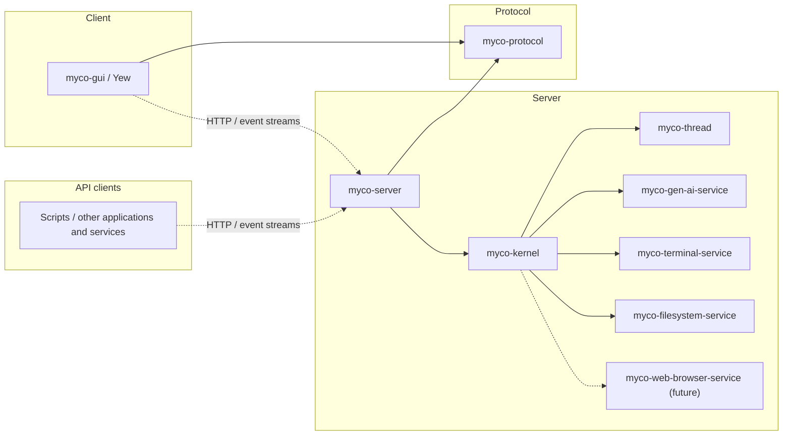

# Architecture and interfaces

Proposed contracts for the rewrite, implemented in the review sequence below.

## Crates



| Crate | Responsibility |
| --- | --- |
| `myco-thread` | Thread data, provider-neutral conversation vocabulary, typed operations, and workflow functions. |
| `myco-gen-ai-service` | Single-turn inference through a concrete async `GenAiClient`; a `Config` enum selects private backend drivers. |
| `myco-terminal-service` | `TerminalClient` and its worker: shared terminals/processes, operation records, cancellation, and output streams. |
| `myco-filesystem-service` | `FilesystemClient` and its worker: reading, creating, and editing files with version checks. |
| `myco-web-browser-service` (future) | Browser control and observation APIs. |
| `myco-kernel` | Workflow execution, thread storage, tool adapters, interpretation, supervision, workspace routing, and service discovery. |
| `myco-server` | HTTP adapter over the kernel: wire conversion, endpoints, streams, and application startup/shutdown. |
| `myco-protocol` | Versioned HTTP and streamed-event schemas, independent of engine types and storage formats. |
| `myco-gui` | Yew client for conversations and shared service instances. |

`myco-kernel` exposes Rust operations for thread creation, input, history reads,
workspaces, service discovery/controls, and observation streams. It owns or
re-exports the domain types its callers need and runs without an HTTP listener.
`myco-server` maps between this API and `myco-protocol`; the kernel has no
wire-protocol dependency.

Scripts and other applications use the same versioned HTTP API and event streams
as the GUI. Thread creation, input submission, cancellation, service controls, and
observations are available without a browser or interactive client.

Services are independent crates with APIs suited to their capabilities. There is
no common service trait or aggregate services crate. They do not depend on the
thread vocabulary or tool catalog.

Model-facing tools live in `myco-kernel`: definitions, argument schemas, and adapters
that call service APIs or internal kernel operations and translate results. GUI
controls also use service APIs through the kernel and server, sharing the same
instances and observations.
Generation remains an effect whether or not the kernel also exposes it as a tool.

`GenAiClient::generate` returns `Result<Response, Error>` and awaits a fallible callback
for ordered request/progress observations. Request recording precedes dispatch.
Backend dispatch uses a private `Driver` trait; there is no public model trait.

## Workspaces and service APIs

A workspace contains independent threads and shared service bindings on one or
more hosts. Many workflows can progress concurrently, including several coding
conversations and their delegated work. Each thread has its own append boundary;
there is no workspace-wide conversation writer. User-facing agents or sessions
can group threads without owning them or imposing a common lifecycle.

The kernel registers service instances within workspaces. Discovery lists instance
IDs, service kinds, and API versions; resolution checks the workspace and expected
kind before returning a bound client. A binding identifies the instance and its
configuration, including host and working directory/root where applicable.
Different services keep their own request/result types. The kernel maps operation
IDs into service records and pins bindings for retries; discovery never silently
substitutes another instance for an unavailable target.

Kernel tools can create, fork, read, submit input to, or request work on another
thread in the workspace. A subagent tool starts a workflow on a new thread and
records its relationship to the requesting operation. Creation is deduplicated
by operation ID; input acceptance and the eventual reply are separate observations.
These tools call kernel operations directly. Inference remains the responsibility
of `myco-gen-ai-service`.

### Hosts and remote transport

Local host services run in-process. A remote service instance lazily starts its own
worker through a noninteractive SSH subprocess. The service crates provide
`myco-terminal-worker` and `myco-filesystem-worker` executables alongside their
libraries. Each service client owns its remote subprocess, pipe, framing, and
reconnection logic behind the same typed API. The kernel manages the lifetime of
the clients; workflows and GUI clients share them across calls.

Each worker exposes its service's methods, independently of model-facing tools
in the kernel. The service owns its worker protocol and codecs, separate from the
public HTTP schemas in `myco-protocol`. SSH stdio has no PTY; requested terminals
allocate PTYs inside the terminal worker. Standard output carries protocol frames,
and diagnostics use standard error. The handshake verifies the service instance
and compatible worker/protocol versions. Gen AI uses its configured inference
endpoints from the server; workflows, model-provider credentials, and conversation
state remain there.

| Transport | Benefits | Costs |
| --- | --- | --- |
| Separate service workers and pipes — initial design | Independent worker restarts and queues; each worker serves one API. | More subprocesses and connections unless SSH sharing is configured. |
| One combined worker and pipe per host | One launch, handshake, and reconnect lifecycle. | Shared worker failure; cross-service routing, flow control, and fair scheduling inside Myco. |

Separate pipes can still share one underlying SSH connection using OpenSSH's
configured [`ControlMaster`](https://man.openbsd.org/ssh_config#ControlMaster).
Each SSH channel has its own flow-control window
([SSH channel protocol](https://www.rfc-editor.org/rfc/rfc4254.html#section-5)).
Myco works with independent connections when sharing is unavailable and does not
manage a private SSH master initially. Shared transport still means shared network
failure and bandwidth; separate workers isolate service process failures.

Each service protocol still needs bounded frames, request IDs for concurrent calls,
chunked bulk data, and backpressure. It must keep cancellation responsive among its
own operations. Request IDs identify waits on the current pipe; stable operation
IDs correlate durable records across reconnects. Closing one observation or
cancelling one call does not close the service pipe. Kernel bindings scope service
instances to workspaces; transport sharing never merges their namespaces.

In the first implementation, each worker follows its SSH stdio lifetime and
attempts supervised shutdown on disconnect. Connection loss leaves outstanding
outcomes unknown; it does not prove that a command or edit failed. Reconnect checks
durable operation records before resubmission. Terminal survival across a lost
worker is not promised.

### Terminal

`TerminalClient` addresses a workspace-bound service instance. Processes have
stable `ProcessId`s independent of conversation threads:

```rust
impl TerminalClient {
    pub async fn start(&self, request: StartProcess) -> Result<ProcessId, TerminalError>;
    pub async fn control(&self, request: ControlProcess) -> Result<ControlReceipt, TerminalError>;
    pub async fn read(&self, request: ReadOutput) -> Result<OutputPage, TerminalError>;
    pub async fn list(&self) -> Result<Vec<ProcessInfo>, TerminalError>;
    pub async fn inspect(&self, process: ProcessId) -> Result<ProcessInfo, TerminalError>;
    pub async fn operation(&self, id: OperationId) -> Result<OperationRecord, TerminalError>;
}
```

`StartProcess` supplies an operation ID, command, working directory, environment,
and pipe or PTY mode. Start returns after durable acceptance; process exit is
observed later. `ControlProcess` carries its own operation ID and a command:
write input, resize a PTY, signal, close/reap, or cancel a target operation.
Cancellation can arrive before start; repeated identical requests reuse their
records. Writes are serialized per process, and receipts report partial delivery.
An input receipt does not imply that a command finished.

`ReadOutput` supplies a cursor, byte limit, and bounded wait. `OutputPage` contains
bytes tagged by stream, the next cursor, retention gaps, process status, and
end-of-output status; PTY output is merged. Readers have independent cursors, so
a GUI and several workflows do not consume each other's output. Slow readers
cannot block process draining. Exit status includes code or signal; an idle wait is not an exit.
Lost workers require reconciliation, not a claim that process state was restored.

The kernel's `bash` adapter builds finite execution and interactive waits from
these operations. GUI terminals use the same process IDs and output records.
Processes belong to the workspace and survive HTTP client disconnects and
compaction.

### Filesystem

`FilesystemClient` exposes file operations independently of model-facing tool schemas:

```rust
impl FilesystemClient {
    pub async fn read(&self, request: ReadFile) -> Result<FileContent, FilesystemError>;
    pub async fn list(&self, request: ListDirectory) -> Result<DirectoryPage, FilesystemError>;
    pub async fn create(&self, request: CreateFile) -> Result<FileVersion, FilesystemError>;
    pub async fn edit(&self, request: EditFile) -> Result<FileVersion, FilesystemError>;
    pub async fn operation(&self, id: OperationId) -> Result<EditRecord, FilesystemError>;
}
```

Reads return bounded bytes or a text range, explicit truncation, and a version of
the whole file; directory listings are paginated. Mutations carry operation IDs.
Create requires an absent path. Edit requires an expected file version and selects
literal replacement, insertion after a line, or whole-file write for GUI saves.
Replacement requires a nonempty search string with exactly one match; insertion
uses one-based lines, with zero meaning the beginning of the file.

The kernel's `str_replace_based_edit_tool` adapter maps view/create/replace/insert
onto these operations. It supplies the expected version from a recorded read or
successful mutation available to the calling workflow. Provenance must remain
available across compaction; a prose summary alone cannot establish a file version.
GUI saves supply their own observed version. File versions are explicit API
values; the service does not maintain a conversation-specific read cache.

The service serializes edits to each resolved target, rejects stale versions, and
publishes complete files atomically while preserving permissions and symlink
targets. Version checks detect observed external changes; they cannot exclude
arbitrary writers that bypass the service. Records retain mutation intent and
before/after versions for reconciliation; an ambiguous insert is not blindly
replayed. Filesystem and terminal bindings can address the same host/files.

## Threads

A thread is an identified, ordered, append-only conversation. Existing entries
and published revisions are immutable; appending produces a new revision under
the same ID. A fork gets a new ID and copies a fixed prefix. A reference used as
generation context pins a revision and range, so later appends cannot change it.

```rust
#[derive(Clone, Copy, PartialEq, Eq)]
pub struct ThreadVersion {
    pub thread: ThreadId,
    pub revision: Revision,
}

#[derive(Clone)]
pub struct HistoryRef {
    pub version: ThreadVersion,
    pub entries: std::ops::Range<usize>,
}

#[derive(Clone)]
pub struct Thread {
    version: ThreadVersion,
    entries: Vec<Entry>,
    sources: Vec<HistoryRef>,
}

impl Thread {
    pub fn version(&self) -> ThreadVersion;
    pub fn entries(&self) -> &[Entry];
    pub fn sources(&self) -> &[HistoryRef];
}
```

Owned values use dense vectors. Cloning copies the entries and provenance of that
value, preserving identity and revision; it grants no write authority and does not
recursively copy referenced threads. The kernel applies validated appends to
private buffers and publishes them only after commit. There is no required
`Agent`, `Session`, foreground thread, or execution phase inside a thread.

Thread IDs are the public address for reading history and submitting input.
The kernel resolves a request for current history to a fixed `ThreadVersion`
before using it in work. Lineage records sources without giving one thread
ownership of another. Workspace checks apply to references as well as writes.

## Operations and workflows

Thread data, operations on threads, and application policy are separate modules
in `myco-thread`. The library contains no service clients or storage handles.
An application is a composition of ordinary Rust functions using typed operations:

| Operation | Meaning |
| --- | --- |
| Create | Publish a new thread from explicit entries and source references. |
| Append | Extend a thread if its expected revision is still current. |
| Fork | Create a new thread by copying a fixed, valid conversation prefix. |
| Generate | Request one candidate from a fixed context; accepting it is a separate append. |
| Invoke tool | Request a logical capability through a kernel adapter. |
| Cancel | Record cancellation of an operation and observe its eventual outcome. |

Workflow authors use async functions, loops, and small helpers. A concrete
`Workflow` context constructs operations and awaits their recorded results.
Its methods do not execute service I/O. The runner exposes pending commands as
data to the kernel, which persists and interprets them.

```rust
impl Workflow {
    pub async fn create(&self, seed: ThreadSeed) -> Result<ThreadVersion, WorkflowError>;
    pub async fn append(&self, at: ThreadVersion, entries: Vec<Entry>) -> Result<ThreadVersion, WorkflowError>;
    pub async fn fork(&self, source: HistoryRef) -> Result<ThreadVersion, WorkflowError>;
    pub async fn generate(&self, intent: GenerationIntent) -> Result<GenerationOutcome, WorkflowError>;
    pub async fn invoke(&self, call: ToolInvocation) -> Result<ToolOutcome, WorkflowError>;
    pub async fn cancel(&self, target: OperationId) -> Result<CancelReceipt, WorkflowError>;
}
```

For example, compaction composes thread operations with the ordinary reply
workflow. The seed helpers are pure functions that choose the prompt, references,
summary entries, and complete recent turns to retain:

```rust
async fn compact(
    cx: &Workflow,
    request: Compaction,
) -> Result<ThreadVersion, WorkflowError> {
    let worker = cx.create(summary_seed(&request)?).await?;
    let summary = reply(cx, worker).await?;
    cx.create(compacted_seed(&request, &summary)?).await
}
```

`reply` generates, validates and appends a candidate, invokes any complete tool
calls, appends their results, and repeats until a reply finishes. These are named
helpers around a small loop. Completion, refusal, truncation, failures, and budget
usage have explicit outcomes. Streaming text and incomplete tool arguments cannot
authorize execution.

A workflow run identifies an execution and its journal. It can read or produce
many threads; it neither owns them nor groups them into a session. A chat UI can
remember a selected thread, a background workflow can produce successive threads,
and search can fork a prefix into parallel candidates. These policies compose
the same operations; the thread model does not prescribe them.

## Async execution and durability

The runner retains the explicit data boundary beneath workflow syntax:

```rust
pub struct Command {
    pub id: OperationId,
    pub operation: Operation,
}

pub enum Operation {
    Create(ThreadSeed),
    Append { at: ThreadVersion, entries: Vec<Entry> },
    Fork(HistoryRef),
    Generate(GenerationIntent),
    Invoke(ToolInvocation),
    Cancel { target: OperationId },
}

pub struct Advance {
    pub commands: Vec<Command>,
    pub outcome: Option<WorkflowOutcome>,
}

impl Execution {
    pub fn advance(&mut self, activation: &Activation) -> Result<Advance, ReplayError>;
}
```

`Activation` supplies recorded inputs, command acknowledgements, and outcomes.
`Execution` caches one future and its bookkeeping. Advancing it is synchronous
and performs no external I/O; only the kernel can commit and execute its output.
Unconfirmed commands retain their IDs and contents for retry. Mutable access
serializes advancement of one execution; the kernel serializes its journal writer.
The runner bounds work at operation boundaries so replay cannot starve input or
cancellation. Pure helpers must also return promptly.

The async function expresses control flow; the durable contract is its command
and outcome history. Rust's generated futures have an
[unspecified representation](https://doc.rust-lang.org/reference/expressions/block-expr.html#async-blocks).
They are cached execution state, never the storage format.

The kernel starts a run with a recorded function/version and explicit inputs.
The runner polls it until it yields commands, waits for outcomes, or finishes.
New commands receive stable IDs within that run and are persisted before execution.
On completion, the kernel records the outcome before resuming the waiting future.

After restart, the runner reconstructs the future by replaying the function.
Each operation checks its kind and arguments against the corresponding journal
entry. Outcomes become visible in their recorded activation order, preserving
yield boundaries even when the entire journal is already loaded. Once visible,
a recorded result returns immediately. An existing pending command waits for
reconciliation; it is not a new request. A command beyond the recorded history
is proposed as new work. Missing, mismatched, or unconsumed history stops replay
explicitly.
This follows the [durable replay model](https://github.com/temporalio/sdk-rust/blob/main/arch_docs/sdks_intro.md);
it does not require adopting Temporal or a new language.

Workflow code must be deterministic between operations. Model calls, tool I/O,
time, randomness, fresh IDs, configuration reads, and external input go through
recorded operations or explicit recorded inputs. Pure computation and ordinary
async helper composition are allowed. Rust does not enforce this restriction;
code review and replay checks are part of the contract.

Parallel work uses ordered command batches and a deterministic join helper.
Results are correlated by operation ID, not arrival order. If a workflow branches
on which operation finishes first, that choice must be recorded. Arbitrary Tokio
tasks, unrecorded timers, and randomized selection are outside workflow code;
the kernel may use them for actual service I/O.

Changes to a workflow must preserve its recorded command sequence or start a new
version. Old runs require their compatible implementation; an unavailable version
is a visible recovery error. Version IDs alone do not make changed code replayable.
Long-lived applications compose bounded runs and record explicit continuation
inputs; compaction of conversation history does not trim execution journals.

The implementation starts with a small async/replay experiment before committing
to a full runner. It must demonstrate crash recovery, concurrent commands,
cancellation, and mismatched-history rejection through the same data boundary.
The thread and service APIs do not depend on a particular workflow engine.

## Context and compaction

Conversation values are independent of provider formats:

| Concept | Meaning |
| --- | --- |
| Entry | Accepted user input, assistant content, tool invocation, or tool result. |
| `GenerationIntent` | Target revision, instructions, and additional fixed history references. |
| Candidate | Proposed ordered content, completion status, usage, and evidence. |
| `ToolInvocation` | Logical capability, complete structured arguments, and invocation ID. |
| Outcome | A recorded result or failure correlated with an operation. |

```rust
pub struct GenerationIntent {
    pub source: ThreadVersion,
    pub instructions: String,
    pub context: Vec<HistoryInput>,
}

pub enum HistoryInput {
    Inline(HistoryRef),
    Readable { name: String, history: HistoryRef },
}
```

The workflow chooses instructions and context. The kernel renders the target
conversation and resolves additional history. Inline history is quoted source
material. Readable history is advertised through a history-reading tool; its
display name may resolve to a path, but its identity remains the fixed reference.
Only advertised, workspace-authorized references can be read through that tool.

For compaction, the request pins source ranges from one or more threads and a
suffix of complete turns to retain. A new summarization thread reads those
sources. Its successful result seeds a third thread with the summary and retained
turns. Source and worker histories remain available. Cuts preserve complete tool
invocation/result groups. Failure before publication leaves the sources intact;
cancellation committed first prevents publication. A continuation already
published before cancellation remains available but is not automatically resumed.

Sources can continue to grow because the request uses fixed revisions. The new
thread therefore summarizes those revisions only. Selecting it as a UI's current
conversation or resuming work there is an explicit application decision. Automatic
switching checks the expected selection and source revision; a late summary never
silently replaces newer work.

Compaction is a workflow, with its prompt and policy in the library. It is not a
special phase or method of a source thread. A surrounding conversation function
decides when to compact and then calls `reply` on the new thread. The reply loop
can yield at a context limit, keeping these helpers free of mutual recursion.
Search uses the same fork/generate operations, then selects a continuation.
Candidates must isolate tool workspaces or defer tool effects until selection.

## Interpretation

Gen AI request, response, and tool-call types exist only in kernel interpreters.
The generation interpreter resolves the fixed conversation, selected history,
capabilities, and model/backend binding; records the exact request and resolved
configuration; then calls `GenAiClient`. It retains the observations and translates
the outcome into conversation values.

Native continuation, provider metadata, and mappings from provider call IDs to
conversation invocation IDs remain in interpreter records. Those IDs are distinct
from operation IDs. Evidence is durable before a thread entry or command result
can refer to it. Retained histories keep their evidence reachable. Continuation
can be reused only when it represents the selected context; otherwise the
interpreter reconstructs that context or reports an incompatibility.

Tool adapters validate against pinned schemas, invoke a service or internal kernel
operation, and record a translated outcome. GUI controls use the same service
instances through direct kernel operations. Interpreter versions and bindings
remain fixed for recovery and replay.

## Commit, cancellation, and recovery

Every operation is data with a stable ID. Thread creation, append, and fork are
kernel storage commands. Generation, tool invocation, and cancellation request
effects. Both are journaled; replay returns their prior results, including
conflicts, instead of repeating them against newer state.

The kernel commits new command records and their outbox entries atomically before
dispatch. Applying a storage command atomically checks its preconditions, publishes
thread changes, and records the receipt. Creation IDs are deduplicated; append
checks the expected thread revision. Rejecting a command changes no thread.
There is no automatic rebase of a stale generation onto newly appended input.

Only committed commands reach the executor. After an ambiguous commit, recovery
looks up the stable operation ID. A retained in-memory future cannot advance past
an unconfirmed storage result. On uncertain runner state, discard it and replay
the committed journal. The durable outbox survives lost executor wakeups.

Each thread's appends are serialized. Different threads and service operations
progress concurrently. The standard reply workflow admits one active turn per
thread and queues subsequent input; completion and cancellation remain responsive.
Parallel hypotheses use separate forked threads. A second writer still needs
revision checks, even if it holds a cloned `Thread` value.

Cancellation is a durable input to a run or operation. The kernel gates new work
after cancellation commits and requests cancellation of dispatched effects.
Publishing a compaction result checks this gate in the same transaction as thread
creation. Commit order resolves races; cancellation does not erase already
published threads or undo external side effects.

Dropping a waiter is not cancellation. Lost HTTP connections do not own workflow
lifetimes. Dropping a local model future releases that request without proving the
provider stopped computing or billing. Outstanding operations remain recorded
until terminal outcomes or explicit unresolved status are available.

Retain thread history, workflow journals, interpreter evidence, and service
records with their operation links. A missing result may follow a successfully
executed edit or command. Reconcile using its existing ID; never blindly submit
it under a new ID. Deduplication of requests cannot guarantee exactly-once external
side effects, and model providers may not deduplicate attempts.

## Lifecycle and evaluation

The kernel resolves workspace bindings, restores runs, reconciles operations,
and accepts new work. Shutdown stops intake, finishes or reconciles commits,
applies cancellation policy, and closes service clients. Each service manages its
workers. The server starts the kernel and HTTP listeners and forwards shutdown
signals; Rust applications can manage the kernel directly.

The HTTP API covers workspaces, threads, workflow requests/results, service
controls, and observation streams. Mutations carry deduplication IDs; acceptance
and completion are separate. Stream cursors support reconnects. The Yew GUI and
scripted clients use the same API. Workspace membership alone provides no
filesystem isolation.

Evaluations run workflow functions against recorded or scripted operation results
and inspect emitted commands and resulting threads. Real trials use kernel
interpreters with budgets, isolated workspaces, and graders. Neither requires an
HTTP server. GEPA can vary prompts or workflow policy and inspect trial scores,
traces, and diagnostic feedback. Replaying an existing run reproduces its recorded
outcomes; testing changed policy starts a new run with explicitly shared inputs.

## Review sequence

1. **Interfaces:** thread data, operations, workflow authoring/replay contract,
   service boundaries, and commit semantics.
2. **Gen AI service:** `GenAiClient` and private drivers; local HTTP fixtures for
   awaited observations, native continuation, incomplete outcomes, and cancellation.
3. **Threads and workflow experiment:** vector histories, fixed references,
   async functions emitting commands, deterministic replay, and small reply and
   compaction examples. Check stale appends, independent clones, lost futures,
   pending-command recovery, parallel joins, cancellation, and workflow version drift.
4. **Terminal service:** `TerminalClient`, shared processes, cursor-based output,
   cancellation, deduplication, and local/SSH backends. Check independent readers,
   input ordering, PTY controls, concurrent replies, backpressure, and worker loss.
5. **Filesystem service:** `FilesystemClient`, bounded reads, create/edit, operation
   records, and local/SSH backends. Check stale edits, ambiguous matches, symlink
   targets, create conflicts, and recovery after interrupted writes.
6. **Kernel:** interpreters, journals/outbox, storage commands, workflow execution,
   and shutdown. Check replay without repeated I/O, exact-context interpretation,
   cancellation/publication races, concurrent workflows per workspace, discovery,
   and internal delegation through thread operations.
7. **Server/protocol:** HTTP schemas, endpoints, and streams over the Rust API;
   exercise the same contracts from scripted clients.
8. **GUI:** thread browsing, optional conversation grouping, and shared service
   controls in Yew.
9. **Evaluation/GEPA:** isolated trial fixtures and inspectable optimizer feedback.
