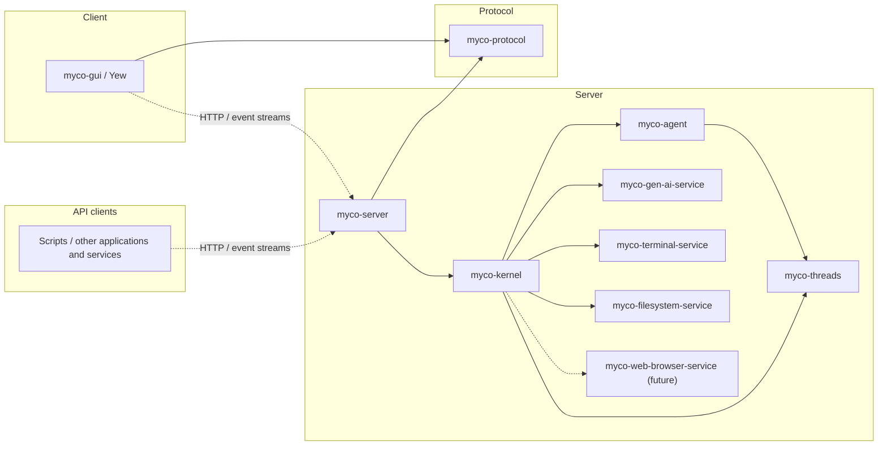

# Architecture and interfaces

Proposed contracts for the rewrite, implemented in the review sequence below.

## Crates



| Crate | Responsibility |
| --- | --- |
| `myco-threads` | Thread history, append/fork operations, and streaming generation through injected storage and inference dependencies. |
| `myco-agent` | Agent policy composed from the threads API: tool loops, compaction, budgets, and delegation. |
| `myco-gen-ai-service` | One-attempt inference through a concrete `GenAiClient` and generation stream; a `Config` enum selects private backend drivers. |
| `myco-terminal-service` | `TerminalClient` and its worker: shared terminals/processes, operation records, cancellation, and output streams. |
| `myco-filesystem-service` | `FilesystemClient` and its worker: reading, creating, and editing files with version checks. |
| `myco-web-browser-service` (future) | Browser control and observation APIs. |
| `myco-kernel` | Dependency construction, storage implementations, provider/tool adapters, supervision, workspace routing, and service discovery. |
| `myco-server` | HTTP adapter over the kernel: wire conversion, endpoints, streams, and application startup/shutdown. |
| `myco-protocol` | Versioned HTTP and streamed-event schemas, independent of engine types and storage formats. |
| `myco-gui` | Yew client for conversations and shared service instances. |

`myco-kernel` exposes Rust operations for agents, thread creation, input, history reads,
workspaces, service discovery/controls, and observation streams. It owns or
re-exports the domain types its callers need and runs without an HTTP listener.
`myco-server` maps between this API and `myco-protocol`; the kernel has no
wire-protocol dependency.

Scripts and other applications use the same versioned HTTP API and event streams
as the GUI. Thread creation, input submission, cancellation, service controls, and
observations are available without a browser or interactive client.

Services are independent crates with APIs suited to their capabilities. There is
no common service trait or aggregate services crate. They do not depend on the
thread vocabulary or tool catalog.

Model-facing tools live in `myco-kernel`: definitions, argument schemas, and adapters
that call service APIs or internal kernel operations and translate results. GUI
controls also use service APIs through the kernel and server, sharing the same
instances and observations.
`GenAiClient::generate` returns a concrete `Generation` implementing
`Stream<Item = Result<Event, Error>>`. It yields the request before dispatch,
ordered progress, and one `Completed(Response)` after validation. The caller can
persist each item before polling again. Backend dispatch uses a private `Driver`
trait; there is no public model trait. The inference service does not commit turns.

## Workspaces and service APIs

A workspace contains multiple agents, independent threads, and shared service
bindings on one or more hosts. Agents, including subagents, progress concurrently.
Each thread has its own writer; agents keep references to the threads they use.
A session or GUI may group related threads without making that grouping part of
the threads API.

The kernel registers service instances within workspaces. Discovery lists instance
IDs, service kinds, and API versions; resolution checks the workspace and expected
kind before returning a bound client. A binding identifies the instance and its
configuration, including host and working directory/root where applicable.
Different services keep their own request/result types. The kernel maps operation
IDs into service records and pins bindings for retries; discovery never silently
substitutes another instance for an unavailable target.

Kernel tools can create, fork, read, submit input to, or request work on another
thread in the workspace. A subagent tool starts an agent on a new thread and
records its relationship to the requesting operation. Creation is deduplicated
by operation ID; input acceptance and the eventual reply are separate observations.
These tools call kernel operations directly. Inference remains the responsibility
of `myco-gen-ai-service`.

### Hosts and remote transport

Local host services run in-process. A remote service instance lazily starts its own
worker through a noninteractive SSH subprocess. The service crates provide
`myco-terminal-worker` and `myco-filesystem-worker` executables alongside their
libraries. Each service client owns its remote subprocess, pipe, framing, and
reconnection logic behind the same typed API. The kernel manages the lifetime of
the clients; agents and GUI clients share them across calls.

Each worker exposes its service's methods, independently of model-facing tools
in the kernel. The service owns its worker protocol and codecs, separate from the
public HTTP schemas in `myco-protocol`. SSH stdio has no PTY; requested terminals
allocate PTYs inside the terminal worker. Standard output carries protocol frames,
and diagnostics use standard error. The handshake verifies the service instance
and compatible worker/protocol versions. Gen AI uses its configured inference
endpoints from the server; agents, model-provider credentials, and conversation
state remain there.

| Transport | Benefits | Costs |
| --- | --- | --- |
| Separate service workers and pipes — initial design | Independent worker restarts and queues; each worker serves one API. | More subprocesses and connections unless SSH sharing is configured. |
| One combined worker and pipe per host | One launch, handshake, and reconnect lifecycle. | Shared worker failure; cross-service routing, flow control, and fair scheduling inside Myco. |

Separate pipes can still share one underlying SSH connection using OpenSSH's
configured [`ControlMaster`](https://man.openbsd.org/ssh_config#ControlMaster).
Each SSH channel has its own flow-control window
([SSH channel protocol](https://www.rfc-editor.org/rfc/rfc4254.html#section-5)).
Myco works with independent connections when sharing is unavailable and does not
manage a private SSH master initially. Shared transport still means shared network
failure and bandwidth; separate workers isolate service process failures.

Each service protocol still needs bounded frames, request IDs for concurrent calls,
chunked bulk data, and backpressure. It must keep cancellation responsive among its
own operations. Request IDs identify waits on the current pipe; stable operation
IDs correlate durable records across reconnects. Closing one observation or
cancelling one call does not close the service pipe. Kernel bindings scope service
instances to workspaces; transport sharing never merges their namespaces.

In the first implementation, each worker follows its SSH stdio lifetime and
attempts supervised shutdown on disconnect. Connection loss leaves outstanding
outcomes unknown; it does not prove that a command or edit failed. Reconnect checks
durable operation records before resubmission. Terminal survival across a lost
worker is not promised.

### Terminal

`TerminalClient` addresses a workspace-bound service instance. Processes have
stable `ProcessId`s independent of conversation threads:

```rust
impl TerminalClient {
    pub async fn start(&self, request: StartProcess) -> Result<ProcessId, TerminalError>;
    pub async fn control(&self, request: ControlProcess) -> Result<ControlReceipt, TerminalError>;
    pub async fn read(&self, request: ReadOutput) -> Result<OutputPage, TerminalError>;
    pub async fn list(&self) -> Result<Vec<ProcessInfo>, TerminalError>;
    pub async fn inspect(&self, process: ProcessId) -> Result<ProcessInfo, TerminalError>;
    pub async fn operation(&self, id: OperationId) -> Result<OperationRecord, TerminalError>;
}
```

`StartProcess` supplies an operation ID, command, working directory, environment,
and pipe or PTY mode. Start returns after durable acceptance; process exit is
observed later. `ControlProcess` carries its own operation ID and a command:
write input, resize a PTY, signal, close/reap, or cancel a target operation.
Cancellation can arrive before start; repeated identical requests reuse their
records. Writes are serialized per process, and receipts report partial delivery.
An input receipt does not imply that a command finished.

`ReadOutput` supplies a cursor, byte limit, and bounded wait. `OutputPage` contains
bytes tagged by stream, the next cursor, retention gaps, process status, and
end-of-output status; PTY output is merged. Readers have independent cursors, so
a GUI and several agents do not consume each other's output. Slow readers cannot
block process draining. Exit status includes code or signal; an idle wait is not
an exit.
Lost workers require reconciliation, not a claim that process state was restored.

The kernel's `bash` adapter builds finite execution and interactive waits from
these operations. GUI terminals use the same process IDs and output records.
Processes belong to the workspace and survive HTTP client disconnects and
compaction.

### Filesystem

`FilesystemClient` exposes file operations independently of model-facing tool schemas:

```rust
impl FilesystemClient {
    pub async fn read(&self, request: ReadFile) -> Result<FileContent, FilesystemError>;
    pub async fn list(&self, request: ListDirectory) -> Result<DirectoryPage, FilesystemError>;
    pub async fn create(&self, request: CreateFile) -> Result<FileVersion, FilesystemError>;
    pub async fn edit(&self, request: EditFile) -> Result<FileVersion, FilesystemError>;
    pub async fn operation(&self, id: OperationId) -> Result<EditRecord, FilesystemError>;
}
```

Reads return bounded bytes or a text range, explicit truncation, and a version of
the whole file; directory listings are paginated. Mutations carry operation IDs.
Create requires an absent path. Edit requires an expected file version and selects
literal replacement, insertion after a line, or whole-file write for GUI saves.
Replacement requires a nonempty search string with exactly one match; insertion
uses one-based lines, with zero meaning the beginning of the file.

The kernel's `str_replace_based_edit_tool` adapter maps view/create/replace/insert
onto these operations. It supplies the expected version from a recorded read or
successful mutation available to the caller. Provenance must remain
available across compaction; a prose summary alone cannot establish a file version.
GUI saves supply their own observed version. File versions are explicit API
values; the service does not maintain a conversation-specific read cache.

The service serializes edits to each resolved target, rejects stale versions, and
publishes complete files atomically while preserving permissions and symlink
targets. Version checks detect observed external changes; they cannot exclude
arbitrary writers that bypass the service. Records retain mutation intent and
before/after versions for reconciliation; an ambiguous insert is not blindly
replayed. Filesystem and terminal bindings can address the same host/files.

## Threads and injected dependencies

A thread is an identified, ordered, append-only conversation. Existing entries
and published revisions are immutable; appending produces a new revision under
the same ID. A fork gets a new ID and copies a fixed prefix. A reference used as
generation context pins a revision and range, so later appends cannot change it.

```rust
#[derive(Clone, Copy, PartialEq, Eq)]
pub struct ThreadVersion {
    pub thread: ThreadId,
    pub revision: Revision,
}

#[derive(Clone)]
pub struct HistoryRef {
    pub version: ThreadVersion,
    pub entries: std::ops::Range<usize>,
}

#[derive(Clone)]
pub struct Thread {
    version: ThreadVersion,
    entries: Vec<Entry>,
    sources: Vec<HistoryRef>,
}

impl Thread {
    pub fn version(&self) -> ThreadVersion;
    pub fn entries(&self) -> &[Entry];
    pub fn sources(&self) -> &[HistoryRef];
}
```

Owned values use dense vectors. Cloning copies that value's entries and provenance,
preserving identity and revision; it grants no writer and does not recursively
copy referenced threads. The kernel chooses the storage format. Thread data has
no agent policy, foreground selection, or live operation state.

`myco-threads` exposes a concrete `Threads` client. Its methods perform work
through injected dependencies while their futures or streams are polled:

```rust
impl Threads {
    pub fn new(
        store: Arc<dyn ThreadStore>,
        generator: Arc<dyn Generator>,
    ) -> Self;

    pub async fn create(&self, request: CreateThread) -> Result<ThreadVersion, ThreadError>;
    pub async fn read(&self, version: ThreadVersion) -> Result<Thread, ThreadError>;
    pub async fn append(&self, request: AppendEntries) -> Result<ThreadVersion, ThreadError>;
    pub async fn fork(&self, request: ForkThread) -> Result<ThreadVersion, ThreadError>;
    pub fn generate(&self, request: Generate) -> Generation<'_>;
}
```

Mutation requests carry an operation ID and expected revisions. `Generate`
includes a fixed target revision, instructions, and additional history references.
It generates one assistant turn, which can contain tool invocations; executing
those invocations belongs to the application.

`ThreadStore` and `Generator` are narrow, dyn-compatible ports defined by
`myco-threads`. The store loads history, tracks operation intent/outcomes, and
atomically publishes appends with their receipts. The generator streams
provider-neutral deltas and a candidate with usage, finish status, and evidence
references. The kernel implements these ports using its storage and Gen AI
adapter. Provider request/response types remain outside `myco-threads`;
services have no dependency on conversation vocabulary.

A thread permits one active extension at a time. Reads and forks use published
revisions while generation is pending; cancellation does not wait for the writer.
Storage also checks the expected revision, including when another process or a
cloned value attempts a write. A stale candidate is retained as evidence and
cannot silently append onto newer history.

## Streaming generation

All increments belong to one logical turn. The proposed threads stream is:

```rust
pub enum TurnUpdate {
    Delta(TurnDelta),
    Committed(Turn),
}
```

`Generation` implements `Stream<Item = Result<TurnUpdate, ThreadError>>`.
Consumers use `next().await` to receive progress and completion in one path.
Deltas carry the generation/attempt identity and content-block coordinates; they
describe provisional content, including incomplete tool arguments.

The injected generator produces a candidate when inference finishes. The threads
layer validates its correlation and conversation structure, persists its evidence,
and atomically appends the turn with the operation receipt. Only then does it yield
`Committed`. Finish status distinguishes a normal reply, tool calls, refusal,
and output limits; a committed outcome need not be a successful answer.
Incomplete arguments never authorize tool execution.

Successful consumption ends with exactly one `Committed` item. A terminal error
is yielded once and ends the stream. EOF without a terminal provider outcome is
an error. Consumers stopping early cannot infer success. The Gen AI service's
`Completed(Response)` is an inference outcome; it is not a thread commit.

The caller owns polling and backpressure. Dropping a pending `next()` wait leaves
the stream available for subsequent polling. Dropping the owning generation stream
releases its local attempt; operation records preserve unresolved work for
reconciliation. This does not prove the remote provider stopped computing.

Agents consume generation streams and forward updates through their own streams.
The kernel owns those streams and records observations before distributing them
to GUI and HTTP subscribers. Subscribers have bounded queues, cursors, and an
explicit recovery path for gaps. Disconnecting a browser drops its subscription,
not the operation that the kernel is supervising.

Each inference call initially represents one attempt. Retry policy can later live
in `myco-threads` for recoverable generation failures, with explicit attempt
boundaries after visible progress. Retrying an ambiguous operation first reconciles
its record. Resampling an answer or retrying an agent's tool strategy is application
policy; neither silently concatenates output from different attempts.

## Agents as application code

`myco-agent` composes `Threads` with injected tool execution and agent-state
storage. These dependencies return their results directly to the awaiting
function. Small async helpers implement the tool loop, compaction, budgets, and
stopping conditions. There are no returned command batches or replay interpreter.

```rust
impl Agent {
    pub fn run(&mut self, input: Input) -> AgentRun<'_>;
}

pub enum AgentUpdate {
    Generation { thread: ThreadId, update: TurnUpdate },
    Tool(ToolObservation),
    Finished(AgentReply),
}
```

`AgentRun` implements `Stream<Item = Result<AgentUpdate, AgentError>>`.
It appends input, consumes a generation stream, forwards deltas, handles the
committed turn, executes complete validated tool calls, appends results, and
repeats as policy requires. Methods take `&mut self`; an active run exclusively
borrows that agent. Distinct agents run concurrently.

Agent state contains its selected thread references, policy/budget state, and
pending operation IDs. Injected storage records explicit logical checkpoints.
The threads remain independently addressable. Forking an agent creates new
thread identities from fixed histories and copies the relevant policy state;
it does not clone a running stream, future, tool process, or writer.

Other applications can use `myco-threads` directly. Search forks a prefix into
candidate threads, generates concurrently, and chooses a continuation. Candidates
must isolate tool workspaces or defer tool effects until selection. A session can
group threads; a background application can create successive threads without an
enclosing agent object.

The kernel polls concurrent agent streams as updates become ready. Ordinary
async scheduling advances their I/O; it need not reconstruct a function on every
event. Pending streams stay alive when another agent yields. Polling remains
bounded, and cancellation/control input cannot be starved by progress.
Application code must yield during long computation.

## Context, compaction, and interpretation

```rust
pub struct GenerationIntent {
    pub source: ThreadVersion,
    pub instructions: String,
    pub context: Vec<HistoryInput>,
}

pub enum HistoryInput {
    Inline(HistoryRef),
    Readable { name: String, history: HistoryRef },
}
```

The caller chooses instructions and context. The kernel's inference adapter renders
the target conversation and resolves additional history. Inline history is quoted
source material. Readable history is advertised through a history-reading tool;
its display name may resolve to a path, but its identity remains the fixed reference.
Only advertised, workspace-authorized references can be read through that tool.

Compaction policy belongs in `myco-agent`. It pins ranges from one or more source
threads and a suffix of complete turns to retain, creates a summarization thread,
runs generation/tool helpers there, and creates a continuation thread from the
summary and retained turns. Source and worker histories remain available.
Cuts preserve complete tool invocation/result groups.

Sources can continue to grow because compaction reads fixed revisions. Selecting
the continuation and resuming work there are explicit policy decisions, conditional
on the expected source/selection state. A late summary cannot replace newer work.
Failure before publication leaves the sources intact; cancellation committed first
prevents publication. Already published history remains available.

Provider requests, responses, and native tool-call types exist only in the kernel
adapter and Gen AI service. The adapter pins model configuration and capabilities,
records the exact request before polling the inference stream into dispatch,
and translates progress and its final outcome into thread values.

Native continuation, raw provider metadata, and provider-call/invocation-ID
mappings remain in interpreter records. Evidence is durable before a thread or
operation can reference it. Retained history keeps evidence reachable.
Continuation is reusable only when it represents the selected context; otherwise
the adapter reconstructs the request or reports an incompatibility.

Tool adapters validate against pinned schemas, invoke a service or internal kernel
operation, and record a translated outcome. GUI controls use those same service
instances through direct kernel operations.

## Persistence, cancellation, and lifecycle

Each effectful API records intent before dispatch and retains stable operation
IDs across retries. Thread mutations publish history and their receipts atomically.
Service operations also retain their own records. An uncertain response triggers
lookup/reconciliation of the existing operation, not a fresh submission under
a new ID. Request deduplication cannot guarantee exactly-once external effects.

Generation's final append checks its expected revision and cancellation state in
the same transaction. A lost response after commit is recovered from its receipt.
Partial streamed output stays in attempt evidence unless explicitly accepted as
an incomplete turn; it is never mistaken for a finished reply.

Cancellation is an explicit request to the supervised operation. It prevents
undispatched work and requests interruption of active work. Commit order resolves
completion races. Acknowledgement does not undo tool side effects or settle an
unknown outcome. Dropping an observer or an idle wait is not an explicit cancel.

Recovery loads threads, agent checkpoints, and operation records, reconciles
pending work, then resumes the application at a defined logical boundary. A
suspended Rust future is never the persistence format. Applications define their
restart policy; arbitrary function-stack restoration is not promised. Tests use
scripted dependencies and retained observations without requiring deterministic
re-execution of all application code.

The kernel resolves workspace bindings, restores agents, reconciles operations,
and accepts new work. Shutdown stops intake, finishes or reconciles mutations,
applies cancellation policy, and closes service clients. Each service manages its
workers. The server starts the kernel and HTTP listeners and forwards shutdown
signals; Rust applications can manage the kernel directly.

The HTTP API covers workspaces, agents, threads, input/cancellation, service
controls, and observation streams. Mutations carry deduplication IDs; acceptance
and completion are separate. The Yew GUI and scripted clients use the same API.
Workspace membership alone provides no filesystem isolation.

## Evaluation and review sequence

Evaluations inject scripted inference, an in-memory store, and a recording tool
executor, then inspect updates and resulting histories. Real trials use service
adapters with budgets, isolated workspaces, and graders. Neither requires HTTP.
GEPA varies prompts or agent policy and consumes trial scores, traces, and
diagnostic feedback.

1. **Interfaces:** threads/agent boundaries, injected ports, stream completion,
   persistence, cancellation, and recovery.
2. **Gen AI service:** `GenAiClient`, private drivers, and a concrete stream.
   Check request-before-dispatch, ordered progress, explicit completion, native
   continuation, consumer backpressure, concurrent requests, and stream drop.
3. **Threads:** owned vector histories, fixed references, injected storage and
   inference, streamed deltas, and atomic turn publication. Check stale writes,
   independent forks, malformed candidates, dropped waits, ambiguous commits,
   and cancellation/publication races.
4. **Agent:** tool loops, state checkpoints, compaction, and concurrent runs.
   Use scripted dependencies to check context selection, complete tool groups,
   budgets, cancellation, compaction failure, and restart at logical boundaries.
5. **Terminal service:** shared processes, output cursors, deduplication, and
   local/SSH backends. Check independent readers, input ordering, PTY controls,
   concurrent replies, backpressure, and worker loss.
6. **Filesystem service:** bounded reads, versioned create/edit, operation records,
   and local/SSH backends. Check stale edits, ambiguous matches, symlink targets,
   create conflicts, and recovery after interrupted writes.
7. **Kernel:** storage and service adapters, discovery, agent supervision,
   observation delivery, and shutdown. Check provider/thread translation, several
   agents per workspace, internal delegation, and subscriber reconnects.
8. **Server/protocol and GUI:** HTTP schemas/streams exercised by scripted clients,
   then thread browsing, conversation grouping, and shared service controls in Yew.
9. **Evaluation/GEPA:** isolated trial fixtures and inspectable optimizer feedback.
