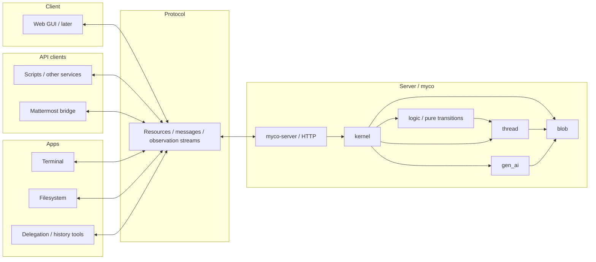

# Architecture and interfaces

Myco is an extensible HTTP server for building and experimenting with agents.
Its Rust library provides the same capabilities without an HTTP listener.
Apps supply tools and integrations; a web GUI is one possible client.

`gen_ai`, `thread`, and `blob` are implemented. The boundaries and review sequence
below describe the proposed server and application layers.

## Components

Keep the engine in one `myco` library crate. `myco-server` is a binary target.
First-party apps can initially be separate binaries in the same package; the app
protocol allows implementations in other languages and separate deployments.

| Module | Responsibility |
| --- | --- |
| `blob` | Shared, immutable, content-addressed bytes. |
| `gen_ai` | Inference requests and streams, with private provider drivers. |
| `thread` | Owned conversation history and local history operations. |
| `logic` | Pure agent, compaction, and supervisor state transitions. |
| `kernel` | Rust API, ownership, persistence, scheduling, routing, and I/O. |
| `app` | App contracts and helpers for implementing apps. |
| `api` | HTTP adapter and versioned wire schemas. |

`logic::agent` and `logic::compact` describe behavior. The effectful kernel lives
outside `logic`. Neither `thread` nor `gen_ai` depends on application logic or on
each other; both use `blob`. The kernel interprets logic's decisions through
inference execution and app message delivery. Provider types stay at that
interpretation boundary.


```mermaid
flowchart LR
    subgraph Server["Server / myco"]
        server[myco-server / HTTP] --> kernel
        kernel --> logic["logic / pure transitions"]
        logic --> thread
        kernel --> thread
        kernel --> gen_ai
        kernel --> blob
        thread --> blob
        gen_ai --> blob
    end
    subgraph Protocol
        api["Resources / messages / observation streams"]
    end
    subgraph Client
        gui["Web GUI / later"]
    end
    subgraph Integrations["API clients"]
        scripts["Scripts / other services"]
        mattermost["Mattermost bridge"]
    end
    subgraph Apps
        terminal[Terminal]
        filesystem[Filesystem]
        delegation["Delegation / history tools"]
    end
    gui <--> api
    scripts <--> api
    mattermost <--> api
    terminal <--> api
    filesystem <--> api
    delegation <--> api
    api <--> server
```

The kernel exposes operations and subscriptions independently of HTTP. The server
composes it with authentication, HTTP listeners, and shutdown handling. Clients
use the same protocol whether they are a GUI, a script, or another service.

## Workspaces, agents, and threads

A workspace contains multiple agents, independent threads, blobs, and installed
app bindings. Agents and subagents can progress concurrently and share app
instances, including the same terminal or filesystem. A workspace scopes access
and discovery; filesystem isolation requires a separate execution policy.

An agent has a durable identity, selected thread references, policy, budgets, and
workflow state. Its identity persists across compaction and thread changes. A run
records a particular execution and its attempts. A supervisor and its subagents
are ordinary agents with explicit relationships and permissions; parenthood alone
does not grant access or determine cancellation behavior.

The kernel owns thread instances and their writers. Public IDs, versions,
serialization, grouping, and derivation relationships belong to the kernel, not
`Thread`. In-memory references may use allocation identity; HTTP and persistence
need stable handles. A session is an optional application grouping.

Forking copies selected histories and policy into a new identity. It does not
clone a suspended future, pending tool execution, or ownership of a running
process. Beam search can operate directly on independent thread copies. Candidate
tool effects must be isolated or deferred until selection.

## Pure logic and runtime execution

Logic consumes explicit state and input and returns a proposed transition:

```rust
fn transition(state: &State, input: Input) -> Result<Transition, Error>;
```

This is the boundary to implement, not a workflow language. A transition describes
state changes and effects, including outgoing messages or generation intent.
Small functions implement agent policy, tool-result handling, compaction, and
stopping conditions. They perform no I/O and hold no runtime dependencies.
Time, allocated IDs, inference outcomes, and app observations arrive as inputs.
The same state and input produce the same decision.

The runtime validates and commits the transition before executing its effects.
Rejected input leaves authoritative state unchanged. Logic enforces invariants
such as history ownership, budgets, cancellation, valid tool execution, and stale
result handling. App protocols can evolve and admit different message sequences
without weakening those invariants. Unsupported, duplicate, late, and out-of-order
messages need explicit handling rather than an assumed request/reply sequence.

One owner serializes state updates for each agent and affected thread. The kernel
runs I/O concurrently with async/await and feeds observations back into logic;
it does not hold a thread writer while waiting on a model or app. Publication
checks the expected thread version and workflow state. Different agents advance
independently, with bounded progress processing so control input is not starved.

## Messages and protocols

The transport delivers independent durable messages. An envelope identifies the
message, workspace, authenticated sender, destination, and versioned protocol,
plus its payload. It does not require a reply, a pending RPC entry, or a live
connection to the sender. HTTP acceptance acknowledges durable receipt; it does
not mean the requested operation has completed.

Start with addressed delivery and scoped subscriptions. Multicast or broadcast
can resolve authorized recipients when a message is accepted and record that
recipient set. Delivery to an app instance is distinct from observation by GUI or
monitoring subscribers; subscribing to traffic does not claim tool execution.

Each protocol defines its own payloads, correlation, lifecycle, and cancellation.
For example, a terminal app may define start, output, exit, and cancel messages
sharing an execution ID. Another app can emit several observations, defer work,
or initiate messages itself. The transport does not enforce a universal pair of
request and response types. Envelope validation and authorization remain strict;
protocol-specific sequencing belongs to its participants.

Message IDs support delivery deduplication. Protocol operation IDs correlate an
app's work across messages and retries. `thread::ToolCallId` associates a model
call with conversation observations. These are different identities: one model
call can cause several app operations, and one operation can emit many messages.

Apps register instances, supported protocol versions, and tool definitions with
argument schemas. Workspace bindings grant access to particular instances.
Dispatch pins the instance and schema version; rediscovery must not silently
retarget uncertain work. App adapters translate their observations into
workflow inputs and model-visible content.

## Apps and integrations

Apps own tool names, schemas, implementations, and resource lifecycle. The kernel
provides the generic catalog, authorization, routing, and execution records.
There is no built-in terminal or filesystem tool catalog in the kernel.
Installing an app initially means registering an executable or endpoint with its
configuration and workspace grants; a package marketplace is a later concern.

An app can expose richer APIs for humans and other software alongside its tools.
These interfaces need not share a Rust trait. A GUI and an agent should address
the same app instance and resources. A delegation app can expose spawning,
messaging, and history-reading as tools while using the kernel's ordinary agent
and thread operations underneath. Kernel operations remain usable without their
tool wrappers.

First-party apps should preserve these contracts from the service design:

| App | Contract |
| --- | --- |
| Terminal | Shared processes and PTYs; ordered input, resize and cancellation; bounded output with independent read cursors; explicit process and execution identities. Disconnecting an observer does not close the terminal. |
| Filesystem | Bounded reads, paginated listings, and versioned create/edit. Literal replacement requires exactly one match; writes reject stale versions and publish complete files atomically. Mutation records preserve uncertain outcomes. |
| Delegation/history | Create agents, deliver inputs, observe progress, and read authorized, pinned history. Repeated delivery must not create duplicate children. |

Filesystem tools, including `str_replace_based_edit_tool`, belong to the app.
An edit uses the version from a recorded read or successful write; summaries do
not establish file versions. External writers remain possible even when the app
serializes its own edits.

Each terminal or filesystem app owns its local implementation and its remote SSH
worker, pipe, framing, and recovery. Keep separate workers and pipes per service;
there is no shared Myco multiplexer. OpenSSH connection reuse can be configured
independently. Worker loss preserves uncertainty about dispatched work; reconnecting
does not imply that an earlier process survived or an edit did not happen.

A Mattermost bridge maps external conversations and authenticated users to
workspace inputs, then publishes selected replies and progress. It records external
message identities to handle retries and avoid echoing its own posts. It is a
normal API client and need not turn conversation delivery into an agent tool.

## Thread history

`Thread` owns a dense `Vec<Turn>` with synchronous `new`, `turns`, `push`, and
read-only indexing. `clone` copies history; `Thread::new(thread[..end].to_vec())`
copies a prefix. Neither starts work. Consecutive user turns are allowed.

User and assistant turns separate conversation roles. Each content part records
its author independently: human, assistant, tool, or system. Authorship does not
determine model instruction priority. Tool requests and multimodal responses sit
alongside content, avoiding recursive payloads. Outcomes distinguish success,
error, backgrounding, and unknown effects; later observations append rather than
overwrite earlier ones. GUI notices and execution lifecycle facts stay in kernel
records unless deliberately projected into conversation content.

Thread and inference types remain separate. Context projection preserves logical
call/result associations, opaque `provider_id` call labels, and exact reasoning
text, signatures, encrypted data, or redacted payloads. Changing providers needs
an explicit policy for incompatible reasoning. Projection can represent a late
completion as a runtime notice after a background acknowledgement has already
closed the model-facing call.

Images hold content-addressed `BlobRef`s. The shared `BlobStore` hashes media type
and bytes, deduplicates inserts, and exposes immutable data. It is append-only;
store clones share the registry and bytes. The kernel owns authorization, limits,
loading, persistence, and lifetime. Blobs must be durable before publishing their
references; a digest itself grants no access.

`GenAiClient` takes a shared store and resolves references when encoding requests.
Provider uploads will live inside its drivers, with remote handles cached within
an endpoint/account and kept out of thread history. Local persistence and provider
uploads are separate steps; current drivers inline image bytes.

The implemented contracts are detailed in [thread](src/thread/README.md),
[blob](src/blob/README.md), and [gen_ai](src/gen_ai/README.md).

## Generation, streaming, and compaction

`GenAiClient` stays a concrete client with private drivers for OpenAI Responses,
OpenAI Chat Completions, and Anthropic. `generate` validates and encodes a request,
returning `Result<Generation<'_>, Error>`. Polling drives network I/O. Each request
supplies its complete selected history; the client owns no conversation state.

Logic chooses instructions, context, and the intended destination. The kernel
adapter translates that intent into inference types and owns the stream. It
records the exact request before dispatch and retains raw progress, deltas,
usage, and the terminal outcome in attempt records. A successful stream yields
one `Completed { message, finish, usage }`; a failed stream yields a terminal
error. A delta is provisional content within one turn, not a committed turn.

Completion becomes an input to logic. Only an accepted outcome committed with
the expected history version and cancellation state becomes a published turn.
Invalid or incomplete tool arguments never authorize execution. Rejected or
interrupted output remains distinguishable in attempt records. A retry is a new
attempt; fragments from different attempts are never silently concatenated.

The kernel owns generation independently of subscribers. Disconnecting a GUI or
dropping an HTTP wait leaves supervised work alive. Dropping the underlying
inference stream releases local resources without proving remote computation has
stopped. Subscriptions have bounded buffers, resume cursors, and explicit gap
recovery; observers cannot block execution indefinitely.

Compaction pins ranges from one or more source histories and a suffix of complete
turns to retain. `logic::compact` plans a summarization thread with its own prompt
and context. Source material can be included directly or exposed through an
authorized history-reading app using fixed references. Successful summarization
creates a continuation thread from the summary and retained turns; original and
working histories remain available.

Cuts preserve complete tool call/result groups. Sources may grow while pinned
history is summarized. Selecting the continuation checks the expected source and
agent selection state, so a late summary cannot replace newer work. Failure or
cancellation before publication leaves the original conversation intact. The same
operations support cross-thread summaries and beam-search evaluation without
requiring a new history abstraction.

## Durability and lifecycle

The first runtime is a single server with durable storage. Accepting a transition
atomically records consumed input, state changes, and pending outbound messages
or other effects. Dispatch begins after commit. A durable outbox can retry delivery;
recipients deduplicate by message identity. Ordering is scoped to the relevant
owner, not a global order across all workspaces.

Apps retain their own operation records. Lost acknowledgements and worker failures
are reconciled through the app protocol using the existing operation identity.
A missing observation denotes an unknown outcome; it is not permission to repeat
an external effect. Delivery may be repeated, and Myco does not promise exactly-once
external execution. Future convenience APIs may publish and await observations,
but the waiting future is never the recovery record.

Cancellation is an explicit input. Committing it prevents new dispatch according
to policy and sends protocol-specific interruption messages for active work.
Completion and cancellation races are settled by committed state transitions;
neither cancellation acceptance nor a disconnected client undoes external effects.

Recovery restores state and delivery checkpoints, reconciles pending effects, and
resumes scheduling. It does not restore Rust futures or replay external effects
while reconstructing logic. Shutdown stops intake, drains or records pending
work, and applies the configured cancellation policy. Apps own worker shutdown.

Stable handles, explicit ownership, and scoped ordering leave room for sharding.
Start with one owner for a workspace; future ownership transfer will require
fencing and recovery. Cross-shard atomic transitions are not assumed.

## Review sequence

Keep implementation PRs small and review each boundary before expanding it.

1. **Foundation:** finish review of the implemented inference, thread, and blob
   interfaces. Provider uploads and local blob persistence remain separate work.
2. **Pure logic:** agent identity/state, generation decisions, tool observations,
   budgets, and cancellation. Test transitions using supplied outcomes, time, and
   IDs; factor compaction and supervision into reusable logic.
3. **Kernel and HTTP:** durable ownership, inbox/outbox, inference execution,
   thread publication, and resumable observations. Exercise multiple agents in a
   workspace, disconnects, duplicate delivery, stale results, and restart recovery.
4. **Apps:** versioned registration and delivery, then terminal and filesystem
   implementations with independent local/SSH workers. Check schema validation,
   authorization, uncertain outcomes, and protocol-specific recovery.
5. **Supervisor and Mattermost:** delegation/history tools and a bridge using the
   public API. Demonstrate a supervisor assigning concurrent work to subagents and
   returning a result after the user disconnects, with inspectable histories.
6. **Evaluation and GUI:** build eval/GEPA runners over the same logic and runtime
   interfaces; add the browser client after the server workflow is useful.

Pure transition tests start with the logic. Runtime and app conformance tests
exercise delivery and crash boundaries separately. Evaluations can supply recorded
inference and app observations or use isolated real app instances with budgets;
GEPA varies policy/prompts and consumes scores, traces, and diagnostic feedback.

Exact message schemas, storage backend, and protocol-specific sequencing remain
review decisions. Implement the smallest complete HTTP workflow first; distribution,
a marketplace, and a workflow language are not prerequisites.
