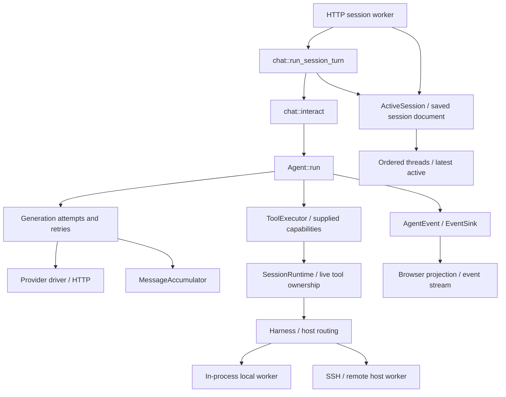

# A guided tour of myco

Myco is a Rust workspace and server for running a coding agent across local and
remote hosts. Start with one concrete interaction: **a user asks the agent to
inspect a file, the model calls a tool, and the model explains the result**.
This tour follows that interaction through the code, then visits persistence
and long-running state. For a quick first pass, read stops 1, 3, and 7.

Open the named functions at each stop; the larger files have substantial test
sections below their implementation. [README.md](README.md) covers running the
program, [AGENTS.md](AGENTS.md) covers contribution rules, and the
[runtime manual](src/manual/articles/overview.md) describes the user-facing
contract.

## 1. Get your bearings

The workspace has three packages. Arrows below point to dependencies:

```text
myco → myco-agent → myco-model
```

`myco` also depends directly on `myco-model`.

| Package | Boundary | Entry point |
|---|---|---|
| `myco-model` | Message types, generation streams, and provider drivers | [model library](crates/myco-model/src/lib.rs) |
| `myco-agent` | Context execution over supplied models, tools, and event sinks | [agent library](crates/myco-agent/src/lib.rs) |
| `myco` | Sessions, live tool resources, hosts, configuration, and frontends | [application library](src/lib.rs) and [server launcher](src/bin/myco.rs) |

The lower crates cannot import application code, even in their tests. The
application reexports them as `myco::generative_model` and `myco::agent`.
Tokio runs the asynchronous work.
The server owns independent session runners; browser tabs observe them over
HTTP and server-sent events. Closing a tab does not stop its runner.



Keep these kinds of state distinct:

| Name | What it holds | Where it lives |
|---|---|---|
| `Agent` | Model context, model and tool executor handles, event sink, retry policy, usage | A live Rust object with an agent UUID |
| `Session` | Ordered threads, model key, title, scratchpad, links, parent metadata | A document under `~/.myco/session/` |
| `Thread` | A linear message history, usage estimate, and optional predecessor thread ID | Inside its session; only the latest thread accepts messages |
| `SessionRuntime` | Active session handle, harness, and live tool ownership | Shared through `Arc`; survives thread and agent changes |
| Bash session | A running child process, stdin, buffered output, and owner | `BashService` on a particular host |

An agent UUID identifies the producer of events. Session and thread IDs identify
persistent context. The runtime's owner UUID identifies live tool resources; a
bash `session_id` names one process managed by a host tool. A tool result records
an observation in a thread, while the underlying process or file can keep changing.
Compaction replaces the active context without replacing the session or its runtime.

## 2. Follow startup to the assembled application

In [src/bin/myco.rs](src/bin/myco.rs), find `main`, then `boot_session`.

`main` loads `.env`, parses options, and starts the browser server, a terminal
adapter (`-p` or `--mode cli`), or the internal SSH host worker. Terminal adapters
live in `src/bin/cli/` and reuse `boot_session` and `SessionRunner`.
The server resolves configuration and startup preflight
once. Each opened session acquires its writer lock, constructs the event sink and
harness with local session tools, then builds its model, runtime, and agent.

`Boot` bundles those resources for the worker. In
[src/bin/browser/runtime.rs](src/bin/browser/runtime.rs), `Sessions` owns workers
and `App` publishes snapshots and changes. The worker retains its runner and
live tools independently of browser connections.

For configuration, read `Config::resolve` in
[src/config/mod.rs](src/config/mod.rs), then the file shapes in
[src/config/file.rs](src/config/file.rs). A **gateway** specifies protocol,
endpoint, and authentication; a **model** names an entry in that catalog and
supplies model-specific settings. The catalog has no built-in model list.

For what actually goes into the model's prompt, follow `build_model` back into
[src/prompts/mod.rs](src/prompts/mod.rs). It combines policy fragments, exported
manual guidance, the prelude, and project guidance. The
[prelude](src/prelude.rs) is durable prompt content stored as entries in the
agent workspace. [src/manual/mod.rs](src/manual/mod.rs) exports embedded articles
to a directory keyed by version and commit; [build.rs](build.rs) supplies the
commit stamp using local Git.

## 3. Cross from chat into the agent

Read `SessionRunner` in [src/chat/runner.rs](src/chat/runner.rs), then its
[submission adapter](src/chat/session_turn.rs) and the pure
[AgentState](crates/myco-agent/src/state.rs).

The server resolves attachments, then calls `SessionRunner::submit`.
The runner holds the session writer across submission, model/tool execution, and
compaction. It binds the latest context, stamps real input, persists observations,
and recovers size-rejected input into a successor thread. An injected `Compactor`
lets scripted workflows use the same automatic compaction and continuation policy.
See [WORKFLOWS.md](WORKFLOWS.md) and the
[offline eval example](examples/scripted_session.rs).

`AgentState` contains only context and control state. Synchronous transitions
return `Effect::Generate`, `Effect::ExecuteTools`, or a terminal result. Operation
identities reject stale completions. `Agent::step` interprets one effect using a
supplied model, tool executor, and event sink; `run_with_outcome` drives it to a
stop reason and reports measured usage. Neither library crate depends on the
application. A caller can replay transitions with fixed observations or run an
in-memory eval with a supplied `ToolExecutor`.

A session-backed agent uses [SessionRuntime](src/session_runtime.rs) as its tool
executor. Its owner UUID identifies bash sessions and editor read fingerprints
across agent replacements and compactions. Session binding installs context and
trace attribution. Runtime observations include model/effort changes, inventories,
and handles unavailable on restart, stored as hidden system parts. Changing
context does not pretend to restore resources.

Checkpoints persist intent before dispatch and results before another effect.
Failure stops execution. Tools run concurrently; `join_all` keeps result order
matched to call order. Cancellation records a result for every call, with unknown
effects when cleanup is not acknowledged. Dropping a step also requires explicit
reconciliation before execution can continue. The runner guards checkpoints against
older writers, even when they refer to the same thread.

For direct execution without a session, `chat::interact` appends input and invokes
`Agent::run`. Or install context with `replace_context` and call the agent directly;
see [tests/headless_agent.rs](tests/headless_agent.rs). For fine scheduling use
`start_run`, `step`, and `replace_at_boundary`; the latter preserves run usage and
truncation policy. The agent tests cover stale completions, failed checkpoints,
concurrent calls, and cancellation without application dependencies.

## 4. Follow one generation to the provider

Open [crates/myco-agent/src/generation.rs](crates/myco-agent/src/generation.rs), then the types in
[crates/myco-model/src/lib.rs](crates/myco-model/src/lib.rs).

A run can contain several generations, and a generation can need several
attempts. Each `GenerativeModel::generate` call is **one attempt**. Its stream
contains `GenerationEvent::Part(MessagePart)` or ends with
`GenerationEvent::Failure(GenerationFailure)`.

`MessagePart` describes streamed response data: content starts and deltas,
tool-call starts and deltas, usage, and the stop reason.
[MessageAccumulator](crates/myco-model/src/accumulator.rs) accepts individual parts
with `push` and produces a `GenerateOutput` with `finish`. It validates message
boundaries, content slots, and tool argument JSON without owning a stream or a
retry policy. `GenerateOutput::from_generation` is a convenience for consuming a
whole attempt when only the completed response or error is needed.

The attempt loop handles failure events directly, retaining the cause, transient
classification, and any provider `Retry-After` hint. Successfully accumulated
parts also drive live text and thinking events.

The agent's generation module owns retries. It starts a fresh attempt with
unchanged history when policy permits, and emits `AgentEvent::Failure` so a
consumer can report what happened. Once any response part has arrived, it will
not retry that attempt: replaying it would duplicate output already observed.
Cancellation covers both an active attempt and the wait before another one.

Choose the driver for the protocol you are investigating:

- [anthropic.rs](crates/myco-model/src/anthropic.rs): Anthropic Messages.
- [openai_responses.rs](crates/myco-model/src/openai_responses.rs): OpenAI Responses.
- [openai_completions.rs](crates/myco-model/src/openai_completions.rs): OpenAI Chat Completions.

Each driver translates shared message types to wire JSON and accumulates
provider events. [driver_core.rs](crates/myco-model/src/driver_core.rs) owns the
shared HTTP/task lifecycle and SSE drive loop;
[sse_parser.rs](crates/myco-model/src/sse_parser.rs) reassembles server-sent event
frames from incoming bytes. Dropping an attempt stream cancels its HTTP work.

For executable examples, read
[the provider wire tests](tests/generative_model_tests/openai_completions.rs).
They exercise real loopback HTTP connections with canned responses, including
a driver that reports one failure and an agent that retries it.

## 5. Follow a tool call to its host

Read `Harness::dispatch_tool_use` in
[src/harness/mod.rs](src/harness/mod.rs). The harness advertises tools to the
model, injects the optional `host` routing field into host-tool schemas, and
routes each call. Omitted `host` means `local`. Local-only services, including
session metadata and prelude editing, are installed by server startup.

A [HostController](src/host/host_controller.rs) represents one execution host.
For `local`, it dispatches directly to an in-process worker. A remote controller
connects lazily to `ssh <alias> myco --mode host`. Model requests and credentials
stay with the agent process; the remote executes tools.

Read [src/host/protocol.rs](src/host/protocol.rs) before the controller's I/O
machinery. It defines newline-delimited JSON requests and responses, correlation
IDs, the resource owner UUID in `agent_id`, and cancellation messages. The connection checks package
versions and supports multiple requests in flight. The
[HostWorker](src/host/host_worker.rs) receives requests and dispatches them to its
service registry without waiting for each tool to finish before reading another
request. Its `JoinSet` reaps completed dispatch tasks between requests, keeping
finished tasks from accumulating over a long-lived connection.

The [ToolService trait](src/tool_services/mod.rs) is the seam for an individual
tool implementation: advertise schemas, dispatch a call, and optionally clean
up resources belonging to a released session runtime. Three useful implementations to visit:

- [BashService](src/tool_services/bash_service/mod.rs): one-shot commands and
  persistent process sessions. Read `execute`, then `run_oneshot` or
  `session_start`. Output collection is bounded; ownership checks keep one
  session runtime from operating another runtime's shells.
- [TextEditorService](src/tool_services/text_editor_service.rs): viewing and
  editing files. A content fingerprint records what was read; mutations check
  it to detect intervening changes. Fingerprints are partitioned by runtime
  owner. Check, mutation, and stamp update share a lock.
- [ViewImageService](src/tool_services/view_image_service.rs): image content
  returned to the model. Shared decoding and size limits live in
  [src/core/image.rs](src/core/image.rs).

The external programs myco spawns are named in
[src/external_command.rs](src/external_command.rs); startup preflight uses that
registry to check availability.

The concurrency claims are easiest to see in
[tests/concurrent_host_tools.rs](tests/concurrent_host_tools.rs). For cancellation
across the agent, controller, worker, and actual process, read
[tests/cancel_composed.rs](tests/cancel_composed.rs) and
[tests/host_cancel_desync.rs](tests/host_cancel_desync.rs).

## 6. Follow output to the screen

Return to `AgentEvent` and `EventSink` in
[crates/myco-agent/src/lib.rs](crates/myco-agent/src/lib.rs), then open
[src/bin/browser/runtime.rs](src/bin/browser/runtime.rs).

The runtime emits text/thinking deltas, tool starts, failures, and completion.
`App` projects these into transcript blocks and publishes updates to clients.
[src/bin/browser/view.rs](src/bin/browser/view.rs) reconstructs blocks from saved
history, preserving observed outcomes and hiding runtime-only context.

[src/bin/browser/assets/app.js](src/bin/browser/assets/app.js) updates the page
incrementally. Markdown rendering lives in
[src/bin/browser/markdown.rs](src/bin/browser/markdown.rs). Authentication and
HTTP endpoints live in [http.rs](src/bin/browser/http.rs); tabs share their event
connection through a browser SharedWorker.

## 7. Follow state onto disk, through resume and compaction

Open `Session` and `ActiveSession` in
[src/session/mod.rs](src/session/mod.rs), then `Thread` in
[src/session/thread.rs](src/session/thread.rs). `Session` is the serializable
document; `ActiveSession` shares it between the server and metadata tools. `active_thread()` returns the latest thread. Older threads are exposed
only as immutable references. Deserialization checks that IDs are unique and
predecessors refer to earlier threads in the same session.

Storage is rooted at `myco_home()` in [src/core/fs.rs](src/core/fs.rs), normally
`~/.myco`, with `MYCO_HOME` available for isolation. All threads live in one JSON
document, rewritten on save: compaction bounds model context, while the saved
session continues growing. Saves use schema version 5, including pending operation
intent and structured system parts; versions 2–4 have explicit upgrades on load.
Reading alone does not rewrite an existing file.

The chat adapter's `wire_checkpoint` binds a checkpoint to a particular thread.
Stale callbacks cannot overwrite a successor. `run_session_turn` force-saves
after a turn, including a failed or cancelled one; server shutdown
also uses `persist_session`. The [session-turn tests](src/chat/session_turn.rs)
verify recovery, queued turns selecting the successor, and cancellation before
queued input is accepted.

Two locks have different jobs. `ActiveSession::writer` serializes chat turns and
compaction inside a process. [SessionWriteLock](src/session/lock.rs) prevents a
second server process from writing the same session. Metadata edits use the shared
document mutex and can continue while a compaction worker runs. Search and
picking live in [src/session/search.rs](src/session/search.rs) and
[src/bin/browser/runtime.rs](src/bin/browser/runtime.rs). The browser lists visible
sessions; `session_meta` also searches saved excerpts and legacy console tails.

Compaction crosses three boundaries while holding the session writer:

1. [src/chat/compact_worker.rs](src/chat/compact_worker.rs) runs a hidden agent
   that reads the active thread and writes a fresh summary.
2. [src/session/compact.rs](src/session/compact.rs) builds a successor thread
   with the summary first and bounded recent context afterward. Copied context
   sheds old identity stamps; the original thread remains intact.
3. `SessionWriter::commit_thread` checks the predecessor, appends the thread to
   the latest session metadata, and saves atomically before switching the live
   document. The runner binds the agent to that thread and rewires checkpoints.

The session ID, writer lock, metadata, and runtime stay
in place. [SessionHistoryTool](src/tool_services/session_history_service.rs)
provides a `threads` listing and a `thread_id` selector for reading original
messages and tool output. Omitting the selector reads the active thread.

A cold resume loads the active thread from disk; it does not recreate bash
processes or editor read stamps. Dropping the last `SessionRuntime` handle
notifies the harness to release its resources. The
[runtime ownership test](src/session_runtime.rs) runs a real shell through
compaction and agent replacement, checks inherited shell variables and immutable
old output, rejects access from another session, and checks final cleanup.

Auto-compaction belongs to `SessionRunner`. It checks reported prompt usage at
settled boundaries, including between tool rounds, and uses the same compaction
path in server and scripted workflows. Nested agents are independent session
workers created through the authenticated API with `parent_session`; `fork: true`
seeds their context from a saved checkpoint.

## 8. Pick your next reading path

| What you want to change | Start here |
|---|---|
| Server options and startup | `Args` and `boot_session` in [the launcher](src/bin/myco.rs) |
| Model settings or authentication | [config resolution](src/config/mod.rs) and [file shapes](src/config/file.rs) |
| Provider payloads or stream handling | [myco-model](crates/myco-model/src/lib.rs), then the relevant driver |
| Message assembly and validation | [message accumulator](crates/myco-model/src/accumulator.rs) |
| Session stamps, turn recovery, and saving | [session-turn adapter](src/chat/session_turn.rs) |
| Retry policy or generation cancellation | [agent generation](crates/myco-agent/src/generation.rs) |
| Tool concurrency, history integrity | `Agent::run` in [agent](crates/myco-agent/src/lib.rs) |
| Remote connection failures | [controller](src/host/host_controller.rs), then [SSH setup](src/harness/ssh.rs) |
| Tool behavior | [tool_services](src/tool_services/mod.rs) and its implementation tests |
| Saved threads or compaction | [session](src/session/mod.rs) and [chat](src/chat/mod.rs) |
| Live tool lifetime across agents | [session runtime](src/session_runtime.rs) |
| Browser rendering | [Browser assets](src/bin/browser/assets/), projection, and Markdown renderer |
| Headless execution / an eval entry point | [agent crate](crates/myco-agent/src/lib.rs), its [in-memory fixtures](crates/myco-agent/src/test_support.rs), and the [application example](tests/headless_agent.rs) |
| Package versions or releasing | [workspace manifest](Cargo.toml), [Publish workflow](.github/workflows/publish.yml), and [release script](scripts/release.py) |

For a first local check:

```bash
cargo test --locked -p myco-model
cargo test --locked -p myco-agent
cargo test --locked -p myco --test headless_agent
cargo test --locked --workspace
```

The ordinary suite uses scripted models and local fixtures. Live-provider tests
are explicitly ignored and require credentials to run. Unit tests sit beside
their implementations; integration tests compose real layers. CI adds
`cargo fmt --all -- --check` and
`cargo clippy --locked --workspace --all-targets -- -D warnings`.

The packages share a version and lockfile. Internal dependencies specify both
local paths and exact registry versions, so workspace development and crates.io
use the same public boundaries. The Publish workflow updates these together
and verifies all package archives before publishing in dependency order. Its
dry run performs that verification without committing or uploading. See the
[release instructions](README.md#release) for partial-publication recovery.

The runtime is usable independently of chat, but the executable still owns it
in-process. A shared service, cross-agent scheduler, and durable eval/learning
pipeline are further work. [TODO.md](TODO.md) records priorities and rejected
ideas; use the source and tests to establish what a particular path does today.
